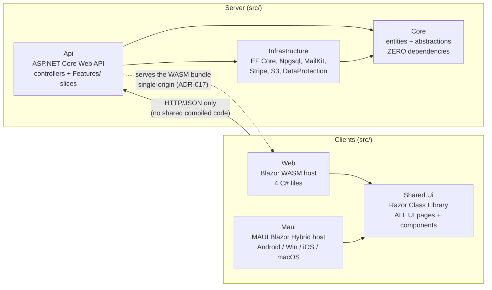
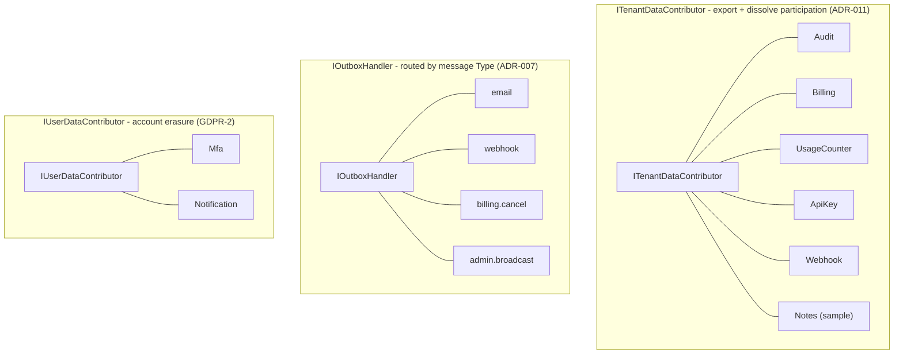
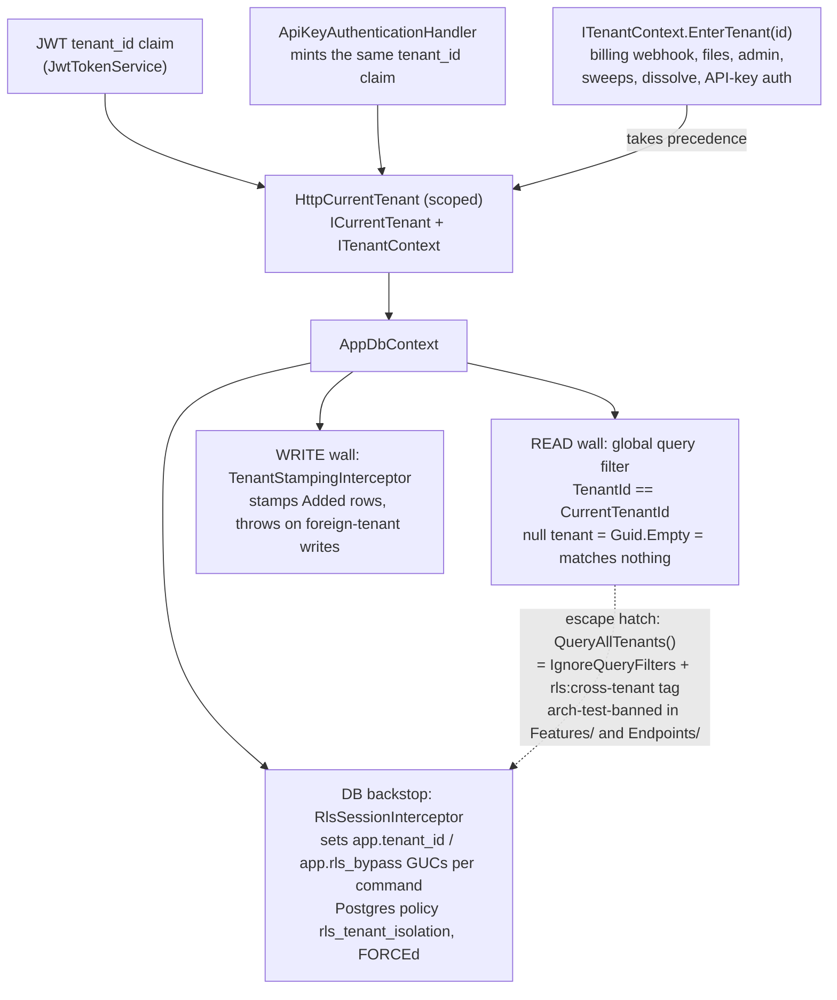
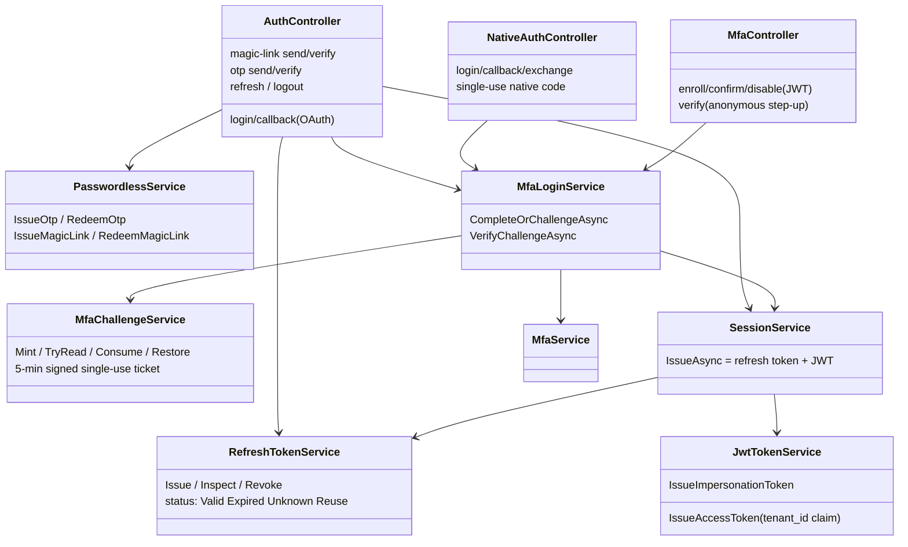
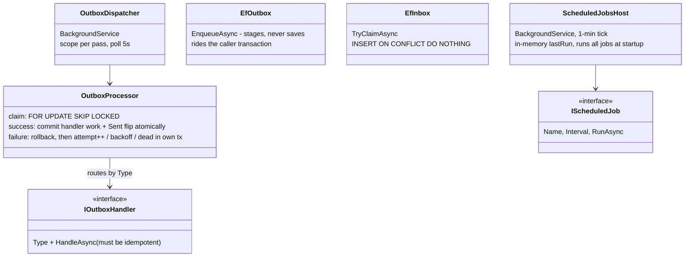
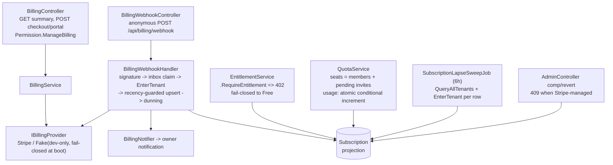
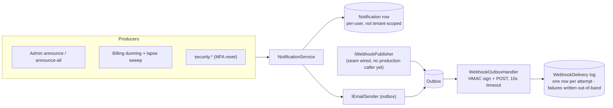
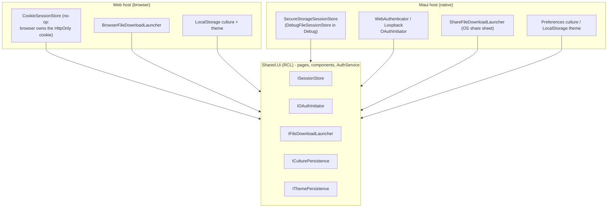

# Architecture — the shape of the platform, in diagrams

> The visual layer over the prose docs. Every diagram here is drawn **from the code as it is**
> (projects, DI registrations, and class dependencies were read, not inferred from other docs);
> file paths are cited so you can verify. The *why* behind each shape lives in
> [`DECISIONS.md`](DECISIONS.md) — each diagram links its ADRs. Call-stack sequence diagrams live
> in [`FLOWS.md`](FLOWS.md); the ER + lifecycle diagrams live in [`DATA_MODEL.md`](DATA_MODEL.md).
>
> Maintenance rule: these diagrams describe the **platform layer** (which is frozen by
> [`CONTRIBUTING.md`](../CONTRIBUTING.md)); they should only need touching when a structural core
> change lands — the same trigger as [`audits/AUDIT_SUITE.md`](audits/AUDIT_SUITE.md).

## 1. Solution map

Two disjoint dependency trees, joined only by HTTP. The server tree is `Api → {Core,
Infrastructure} → Core`; the client tree is `{Web, Maui} → Shared.Ui`. `Shared.Ui` references
**nothing** — client and server share no compiled code, only the JSON contract (documented by the
[Postman collection](postman/README.md), ADR-023). `Core` has zero package references; it is the
enforced dependency floor.

Decisions drawn here: ADR-C3 (clean API boundary), ADR-C5 (RCL), ADR-004 (clean platform +
vertical slices), ADR-018 (MAUI parity) — all in [`DECISIONS.md`](DECISIONS.md).

Tests mirror the trees: `Api.Tests` (server, Testcontainers Postgres/MinIO), `Core.Tests`,
`Ui.Tests` (bUnit over the RCL), `E2E.Tests` (Playwright, black-box — references no project).

## 2. The server onion and its seams

`Api` depends on `Core` abstractions; `Infrastructure` implements them. A feature slice under
`src/Api/Features/` may only touch `Core` seams — rule R8 says only `Program.cs` references
`Features.*`, and the arch tests ban `IgnoreQueryFilters()` there outright.

The seams that matter (all in `src/Core/Abstractions/` unless noted):

| Seam | Implemented by | Purpose / ADR |
|---|---|---|
| `ICurrentTenant` / `ITenantContext` | one scoped `HttpCurrentTenant` serving both | tenant of the request / trusted system entry — ADR-003, ADR-020 |
| `IEmailSender` | `OutboxEmailSender` (default) → `SmtpEmailSender` (keyed `"smtp"`) | all email; MailKit never leaks past `Infrastructure/Email/` |
| `IOutbox` / `IOutboxHandler` / `IInbox` | `EfOutbox` / 4 handlers / `EfInbox` | reliable async effects — ADR-007 |
| `IScheduledJob` | `ExpiredTokenCleanupJob`, `SubscriptionLapseSweepJob` | recurring jobs, no host edits — ADR-007 |
| `IBillingProvider` | `StripeBillingProvider` / `FakeBillingProvider` (dev only, fail-closed at startup) | ADR-006 |
| `IEntitlementService` / `IQuotaService` | `EntitlementService` / `QuotaService` | plan gates (402) and atomic countable limits — ADR-006 |
| `IPermissionService` | `PermissionService` over the `RolePermissions` matrix | capability checks, not role checks — ADR-009 |
| `IFileStorage` / `IFileDownloadTokenizer` | `LocalDiskFileStorage` / `S3FileStorage` | tenant-scoped blobs, signed URLs — ADR-010 |
| `ITenantDataContributor` (×6) / `IUserDataContributor` (×2) | per-slice contributors | export + erasure without central code — ADR-011 |
| `IAuditLog` | `AuditLog` (append-only via interceptor) | ADR-008 |
| `IOutboundUrlGuard` | `OutboundUrlGuard` | SSRF guard for tenant-supplied URLs — ADR-016 |
| `IRepository<T>` / `IUnitOfWork` | `EfRepository<T>` / `EfUnitOfWork` | generic data access; `Query()` auto-scoped, `QueryAllTenants()` greppable |

### Multi-registration fan-outs

Adding a feature never means editing central code — you register another implementation:

## 3. Tenancy — two walls, both directions ([ADR-003](DECISIONS.md), [ADR-020](DECISIONS.md))

The load-bearing detail: **one scoped `HttpCurrentTenant` instance backs both `ICurrentTenant`
and `ITenantContext`** (`src/Api/Configuration/ServiceRegistrationExtensions.cs`), so
`EnterTenant(...)` is immediately visible to the EF filter and the RLS interceptor in the same
request scope. `EnterTenant` **scopes, it does not authorize** — every caller authenticates the
tenant id first by other means (Stripe signature, staff allowlist, signed file token, API-key hash).

Files: `src/Api/Services/HttpCurrentTenant.cs`, `src/Infrastructure/Persistence/AppDbContext.cs`
(filter at 114–128, interceptors at 91–100), `TenantStampingInterceptor.cs`,
`RlsSessionInterceptor.cs`, `RlsDdl.cs`, `RlsPostureGuard.cs` (boot refuses a
superuser/BYPASSRLS runtime role). Known limit encoded as an arch test: query tags don't render
into `ExecuteUpdate`, so set-based cross-tenant writes must `EnterTenant` instead.

## 4. Auth — server side ([ADR-002](DECISIONS.md), [ADR-012](DECISIONS.md), [ADR-C15](DECISIONS.md))

Custom JWT + rotating refresh tokens; no ASP.NET Core Identity. Sequence diagrams for each
sign-in path are in [`FLOWS.md`](FLOWS.md).

Supporting cast: `TokenGenerator` (64 random bytes), `TokenHasher` (SHA-256, constant-time
verify), `RecoveryCodeHasher` (peppered HMAC — recovery codes are low-entropy),
`CookieService` (HttpOnly refresh cookie, `Path=/api/auth`), `UserService`
(get-or-create at *redemption*, never at issue), `LinkTokenService` / `NativeAuthCodeService`
(single-use in-memory cache tokens). External OAuth rides a dedicated 10-minute `"External"`
cookie scheme that is signed out as soon as the callback mints the real session
(`src/Infrastructure/ServiceCollectionExtensions.cs`).

## 5. Background processing ([ADR-007](DECISIONS.md))

Exactly two hosted services. The outbox gives at-least-once delivery with exponential backoff
and dead-lettering; the inbox gives exactly-once *effects* for inbound webhooks. There is no
LISTEN/NOTIFY — the dispatcher polls (5s idle, immediate when draining).

The email pipeline is a decorator chain: app code calls `IEmailSender` → resolves to
`OutboxEmailSender` (enqueues `"email"` + flushes) → dispatcher → `EmailOutboxHandler` →
keyed `IEmailSender("smtp")` = `SmtpEmailSender` (MailKit). The keyed registration is what stops
the handler from resolving its own decorator. Templates: `BrandedEmail` (localized via explicit
`CultureInfo`, logo embedded by CID).

## 6. Billing ([ADR-006](DECISIONS.md), [ADR-021](DECISIONS.md))

Stripe is the source of truth for money; the `Subscription` row is a projection written **only**
by the signature-verified webhook (and the staff comp path). Checkout writes nothing.

## 7. Notifications & outbound webhooks ([ADR-013](DECISIONS.md), [ADR-016](DECISIONS.md))

`NotificationService.NotifyAsync` fans one event into the in-app row and/or a branded email per
the user's `NotificationPreference` — except `security.*` kinds, which force both channels.
Outbound webhooks are HMAC-signed (`X-Webhook-Signature`), SSRF-guarded at create **and** at
send (DNS-rebinding defense), and delivered through the outbox so retry/dead-letter is inherited
rather than bespoke. The webhook send-test endpoint bypasses the outbox and POSTs synchronously.

## 8. Files & GDPR ([ADR-010](DECISIONS.md), [ADR-011](DECISIONS.md))

`IFileStorage` keys are namespaced per tenant (`{tenantId}/{key}`, traversal-validated). Local
disk serves downloads via `/api/files/{token}` — a signed, time-limited (not single-use)
DataProtection token; S3-compatible backends return native presigned URLs and bypass the endpoint.
Export bundles tenant data + every contributor's `ExportAsync` into a JSON blob and returns a
15-minute link. Dissolve and account erasure both fan out over the contributors (§2 diagram) —
`EnterTenant` inside `TenantDissolutionService` is load-bearing, because the contributors'
set-based deletes are gated by RLS on the *ambient* tenant.

## 9. Client architecture ([ADR-C5](DECISIONS.md), [ADR-018](DECISIONS.md), [ADR-022](DECISIONS.md))

All UI lives in the RCL; the hosts are thin composition roots that plug platform implementations
into the same seams. This is the entire mechanism by which one codebase runs in a browser and in
four native shells.

Client HTTP note (`src/Web/Program.cs`): `AuthService` is deliberately a **singleton**, and the
refresh/logout calls use a second named client (`"ApiAuth"`, cookie handler only) to break the
DI cycle with `AuthHeaderHandler`.

## 10. Startup & request pipeline

`Program.cs` order is deliberate; see [`FLOWS.md` §1](FLOWS.md) for the boot sequence (env load →
DI → migrate → RLS posture guard) and §2 for the per-request path. Middleware order:
proxy forwarding → static WASM assets + security headers (config-gated) → HSTS/HTTPS (non-dev) →
CORS → session → **authentication → authorization → request-log scope → rate limiter** →
controllers; then health endpoints, `/api/version`, config-gated PUBAPI/HOOKS maps, and the
SPA fallback (with an explicit `/api/**` 404 guard so unmatched API routes never return the shell).
