# Data Model

> Structural source of truth: entities, fields, relationships, and **derived rules** (computed,
> not stored). Stack-agnostic; concrete EF Core migrations follow in the repo. The multi-tenant
> base entities are constant; everything else is app-specific.

## Conventions
- `id` primary key on every entity unless noted. UUIDv7 (`Guid.CreateVersion7()`) used — time-ordered,
  supported in .NET 9+ and already active in base entities.
- Timestamps (`created_at`, `updated_at`) assumed on all entities; omitted below for brevity.
- **Tenant scoping:** every app entity that holds tenant data implements `ITenantScoped`
  (a `TenantId`) and is filtered automatically by a global EF query filter (see ADR-003) — you
  can't forget to scope a read. Genuinely cross-tenant/pre-auth reads use the sanctioned escape
  hatch **`IRepository<T>.QueryAllTenants()`** (audited; used by dissolve contributors), and a
  signature-/system-authenticated tenant-scoped write enters its tenant via
  **`ITenantContext.EnterTenant(tenantId)`** — `IgnoreQueryFilters()` is **banned in
  `src/Api/Features/**`** (a build-time test enforces it). Never leak across tenants.
- "Tenant" is the code term for the household/org/team. The reference implementation labels it
  **Household**; rename per app.

## Base entities (constant — multi-tenant foundation)

### Tenant
The household/org/team. Owns all tenant-scoped data.
- `id` (UUIDv7)
- `name`
- No app fields on `Tenant` itself — the household's budget configuration lives in its own
  tenant-scoped `BudgetSettings` row (below), so the platform entity stays untouched (ADR-V003).

### User
A person (identity). A user belongs to exactly one tenant **via `TenantMembership`** — there is
**no `tenant_id` on User**. Passwordless-capable; no password is stored.
- `id` (UUIDv7) — a plain POCO, **not** `IdentityUser`
- `email` (unique, normalized lower-case), `display_name` (nullable, refreshed from the provider)
- `email_verified` — true only when a provider asserts a verified email (fail-closed default; this
  guards the credential-attachment takeover)
- `locale` (nullable) — per-user UI language preference
- `theme` (nullable) — per-user UI theme ("light"/"dark"/"system", stored verbatim; null = never
  chose, which lets sign-in adopt a device-local choice — PREFS-1, ADR-022)
- `logins` — navigation to `UserLogin`

### UserLogin
One OAuth identity linked to a `User` (a user may link several providers).
- `id` (UUIDv7), `user_id` (FK → User)
- `provider` ("google", "microsoft", …), `provider_user_id`
- unique on (`provider`, `provider_user_id`)

### TenantMembership *(the user→tenant link — source of truth for tenancy)*
- `id` (UUIDv7), `tenant_id` (FK → Tenant), `user_id` (FK → User)
- **unique on `user_id`** — a user is in exactly one tenant at a time
- `role` — `owner` | `admin` | `member` (exactly one owner per tenant; `admin` is a delegated-management
  tier — ADR-009), `joined_at`. Capabilities per role are defined in `RolePermissions`, not ad-hoc checks.

### RefreshToken
A rotating, hashed refresh token backing a session — only the **hash** is stored, so a DB leak
can't forge sessions.
- `id` (UUIDv7), `user_id`, `token_hash` (SHA-256), `provider`
- `issued_at`, `expires_at`, `is_revoked`, `issued_from_ip`

### LoginToken *(passwordless: magic link + email OTP)*
A single-use, hashed, time-limited credential. The account is resolved/created at redemption, so a
typo'd or probed email leaves no account behind.
- `id` (UUIDv7), `email`, `code_hash` (SHA-256), `purpose` (`magic-link` | `otp`)
- `created_at`, `expires_at`, `consumed_at` (nullable), `attempt_count` (OTP lockout)
- **Derived (computed, never stored):** `is_expired`, `is_consumed`, `is_valid`

### UserMfa *(MFA — authenticator TOTP; ADR-012)*
A user's TOTP second-factor state (one per user). User-scoped identity data (wiped by account erasure).
- `id` (UUIDv7), `user_id` (unique) — one MFA row per user
- `encrypted_secret` — the TOTP secret **encrypted at rest** (Data Protection); never plaintext, never
  returned after enrollment
- `enabled` (true only after a valid code confirms possession), `enrolled_at`
- `last_verified_time_step` (nullable) — the TOTP time-step accepted by the most recent successful
  **login** step-up; a code whose step is ≤ this is rejected as a replay (RFC-6238 anti-replay; v2
  audit LOGIC-S1). Null until the first login step-up; enrollment-confirm deliberately does not set it.

### MfaRecoveryCode *(MFA — ADR-012)*
Single-use recovery codes, stored **only as hashes** (SHA-256); the raw codes are shown once at
enrollment. User-scoped (wiped by account erasure).
- `id` (UUIDv7), `user_id`, `code_hash`, `used_at` (nullable — consumed when set)

### Notification *(in-app notifications — ADR-013)*
A per-user notification. **Keyed by `user_id` — NOT tenant-scoped** (the ADR-C2 per-user carve-out); a
user only ever sees their own. User PII (wiped by account erasure).
- `id` (UUIDv7), `user_id`, `kind` (stable verb), `title`, `body`
- `metadata` (jsonb, nullable — identifiers only, no secrets), `read_at` (nullable), `created_at`
- indexed on `(user_id, created_at)` for the newest-first feed + unread counts

### NotificationPreference *(in-app notifications — ADR-013)*
Per-user delivery preferences (the ADR-C2 per-user carve-out, like `User.Locale`). One row per user;
absence ⇒ both channels on. User PII (wiped by account erasure).
- `id` (UUIDv7), `user_id` (unique), `in_app_enabled`, `email_enabled` (both default true)

### TenantInvitation *(constant — auth foundation)* — implements `ITenantScoped`
An email invitation to join a tenant. The raw token is revealed once at creation; only its hash is
stored.
- `id` (UUIDv7), `tenant_id` (FK → Tenant)
- `invited_email` — normalized lower-case
- `token_hash` (SHA-256) — **no raw token column**
- `invited_by_user_id` (Guid), `status` (`pending` | `accepted` | `revoked` | `expired`)
- `created_at`, `expires_at`

**Derived rules (computed, never stored):**
- `is_expired` → `now > expires_at`
- `is_valid` → `status == pending AND !is_expired`

## App entities

> Ported from the donor's schema (TDD v2.0 §3, 30 migrations collapsed) with the platform's
> conventions applied: UUIDv7 ids, `DateTimeOffset` timestamps, **PascalCase** table/column names
> in EF (the snake_case below is prose), `ITenantScoped` on every household-owned table, and one
> `ITenantDataContributor` per slice. Money columns are `NUMERIC(12,2)`; the per-transaction rate
> `NUMERIC(10,4)`; the refund percentage `NUMERIC(5,2)` (ADR-V004). Dates that are calendar days
> (`transaction_date`, week bounds) are `date` (`DateOnly`), not timestamps.
>
> All entities below implement `ITenantScoped` **except `EmailConnection` and `UserDisplaySettings`** (user-keyed — see them).

### BudgetSettings *(ADR-V003 — new in the port; replaces six columns on the donor's `User`)*
The household's budget structure. Exactly one row per tenant, created with defaults on first use.
- `id`, `tenant_id` (**unique**)
- `week_start_weekday` (int, 0 = Sunday … 6 = Saturday; default 4 = Thursday) — for a weekly-paid household, **the day
  the money moves**: with the anchor `last_weekday_prev`, the weekday decides where each month starts and therefore its
  4 or 5 weeks, so week count = transfer count only when the week starts on the payday (INCOME-1)
- `month_anchor` — `last_weekday_prev` (default) | `first_weekday_current` | `first_of_month`
- *legacy (INCOME-1, ADR-V023)* `primary_income_4w`, `primary_income_5w`, `primary_income_currency`,
  `secondary_income_4w`, `secondary_income_5w`, `secondary_income_currency` — still mapped, read and written by nothing
  (an architecture test guards it): the rollback baseline for `AddIncomeLines`, dropped by the owner-gated INCOME-3

### Category
A spend bucket. Soft-deleted; names are case-insensitively unique per household.
- `id`, `tenant_id`, `name`, `is_active`
- unique on (`tenant_id`, `name`) at the DB (also serialises first-read seeding); the handler enforces case-insensitive uniqueness

### Bank
A money source (a bank or **Cash**). Soft-deleted; unique per household.
- `id`, `tenant_id`, `name`, `is_active`
- unique on (`tenant_id`, `name`)

### Card *(CARDS-1, ADR-V021)*
A payment card the household spends with — identified by what the bank prints, named by the household.
Soft-deleted; never seeded (the first confirmed voucher creates one as `VISA-1234`, `auto_named`).
- `id`, `tenant_id`, `name` (the alias), `brand` (`VISA` | `MASTERCARD` | `AMEX` | `CARD`), `last4`
- `bank_id` (FK → Bank, nullable, no cascade), `auto_named`, `is_active`, `created_at`, `updated_at`
- `brand` / `last4` are the newest number; every number the bank has printed lives in CardIdentity
- `kind` — `credit` (default) | `debit`; decides the `payment_method` of transactions booked through the card (CARDS-3)
- unique on (`tenant_id`, `name`)

### CardIdentity *(CARDS-1)*
One (brand, last four) a card is known by — several after a renewal was merged. Goes with its card.
- `id`, `tenant_id`, `card_id` (FK → Card, cascade), `brand`, `last4`, `created_at`
- unique on (`tenant_id`, `brand`, `last4`) — a number names exactly one card

### Envelope
A savings bucket with an annual target and a reminder cadence. Soft-deleted; a catalog entry
(`ICatalogEntry`) with two extra facts. Never seeded. Holds no balance — contributions are transactions.
- `id`, `tenant_id`, `name`, `annual_target_crc`, `annual_target_usd` (`NUMERIC(12,2)`, either may be 0)
- `reminder_cadence` — `monthly` | `five_week_months`
- `is_active`, `created_at`, `updated_at`
- unique on (`tenant_id`, `name`); the handler enforces case-insensitive uniqueness

### FixedExpense / VariableExpense *(two tables, one shape — `IExpenseLine`)*
A budget line the dashboard compares actuals against.
- `id`, `tenant_id`, `name`, `budget_crc`, `budget_usd`
- `payment_method` — `credit_card` | `bank_account`
- `category_id` (FK → Category, **required**, no cascade — categories are soft-deleted)
- no bank (dropped 2026-09-14, `DropExpenseLineBank`): a plan is "pay by card / by account"; the transaction records the real bank
- `is_active`, `sort_order`

### IncomeLine *(INCOME-1, ADR-V023)*
One of the household's incomes. A catalog entry (soft-deleted, case-insensitively unique per household, 409 reactivation
offer); never seeded; any member edits any line.
- `id`, `tenant_id`, `name` (≤ 100), `member_user_id` (nullable, **no FK** — a household member's id; cleared on account
  erasure), `currency` (`CRC` | `USD`), `kind` — `fixed` | `variable`
- `pay_period` — `weekly` | `biweekly` | `monthly`; `amount` (`NUMERIC(12,2)`, > 0) per payment
- `pay_day1`, `pay_day2` — biweekly only (1–31, 31 = the month's last day; default 15 and 31), null otherwise
- `is_active`, `sort_order`, `needs_review` (set only by the INCOME-1 migration; any update clears it), `created_at`, `updated_at`
- unique on (`tenant_id`, `name`)

### Month
A budget period. Exists **only** through transactions (auto-created, auto-deleted — ADR-V005).
- `id`, `tenant_id`, `year`, `month_number`, `week_count` (4 | 5), `week1_start_date`
- its income is its `MonthIncome` rows (below)
- *legacy (INCOME-1)* `primary_income_amount`, `primary_income_currency`, `secondary_income_amount`,
  `secondary_income_currency` — still mapped, read and written by nothing; the rollback baseline, dropped by INCOME-3
- unique on (`tenant_id`, `year`, `month_number`)

### MonthIncome *(INCOME-1, ADR-V023)*
One income of one month: snapshotted from an IncomeLine when the month is created, or added by hand for that month.
- `id`, `tenant_id`, `month_id` (FK → Month, **cascade**), `income_line_id` (FK → IncomeLine, nullable, **set null**)
- `label`, `member_user_id` (no FK), `currency` — copied from the line, so renaming a line never rewrites history;
  the one exception is the member: when a line's member changes, its rows that still carry the previous member follow
- `amount` (`NUMERIC(12,2)`) — what the month counts; `planned_amount` (nullable) — what the pay period derived at
  creation, null for a one-off
- `sort_order`, `created_at`, `updated_at`

### Week
A materialized week of a month (stored at creation, never recomputed — ADR-V005).
- `id`, `tenant_id`, `month_id` (FK → Month, cascade), `week_number`, `start_date`, `end_date`

### Transaction
Money movement, captured in both currencies at a frozen rate.
- `id`, `tenant_id`, `month_id` (FK → Month, cascade)
- `bank_id` (FK → Bank, **required**, no cascade), `category_id` (FK → Category, **required**, no cascade)
- `payment_method` — `credit_card` (default) | `bank_account`
- `payee`, `original_amount`, `currency` (`CRC` | `USD`), `transaction_date` (date)
- `amount_crc`, `amount_usd`, `exchange_rate_used` — **frozen at creation, never edited**
- `transaction_type` — `budgeted` | `extraordinary` | `unplanned_essential` | `inflow` |
  `envelope_contribution`
- `envelope_id` (FK → Envelope, nullable, no cascade; **required when** `envelope_contribution`)
- `card_id` (FK → Card, nullable, no cascade — null = "no card": cash, transfers, rows from before CARDS-1);
  the card's `kind` sets `payment_method` on a voucher confirm and when one is picked by hand (CARDS-3)
- `notes` — optional, ≤ 250 characters, trimmed; blank is stored as null (the "why", 2026-09-08)
- `source` — `manual` | `email` | `refund_realization`
- indexes: (`tenant_id`, `month_id`), (`tenant_id`, `transaction_date`)

### Refund
An expected refund **derived** from an `unplanned_essential` transaction; only `status` is edited directly.
- `id`, `tenant_id`, `month_id` (FK → Month, cascade), `transaction_id` (FK → Transaction, cascade, **unique**)
- `payee`, `transaction_date`, `percentage`, `amount_crc`, `amount_usd`
- `status` — `pending` | `received`
- `inflow_transaction_id` (FK → Transaction, nullable, set-null) — the realized inflow, present ⇔ `received`
- `notes` (≤ 250) — the household's own field (LEDGER-4): why this refund is expected, case number and all
  (a separate `case_number` column was dropped on 2026-09-14, `DropRefundCaseNumber`). Everything else here is
  derived from the transaction and rewritten on every edit; this one is never touched by that
- `received_date` (nullable) — the day the money landed, present ⇔ `received`; the inflow is dated with it and lives in **that** day's month, not necessarily the refund's (ADR-V017)

### MerchantCategoryMapping
A user-maintained "merchant pattern → category (+ class)" suggestion rule.
- `id`, `tenant_id`, `merchant_pattern`, `category_id` (FK → Category, no cascade)
- `suggested_class` (nullable) — `budgeted` | `extraordinary` | `unplanned_essential`
- unique on (`tenant_id`, `lower(merchant_pattern)`) — a functional index, added by raw SQL in the migration

### PendingVoucher
An inert review-queue draft parsed from an email. Nothing touches the budget until it is confirmed.
- `id`, `tenant_id`, `email_connection_id` (Guid, no FK — the connection is user-keyed), `provider_message_id`
- `fingerprint`, `parsed_bank`, `bank_id` (FK → Bank, nullable, no cascade)
- `merchant`, `amount`, `currency`, `date`, `card_number`, `card_brand` (the label the number sat under, null
  when the voucher names none), `authorization`, `reference`, `transaction_type`, `missing_fields[]`
- `suggested_category_id` (nullable), `suggested_class` (nullable) — copied from a mapping at staging
- `status` — `pending` | `confirmed` | `discarded`
- `confirmed_transaction_id` (nullable), `received_at`
- index on (`tenant_id`, `status`)

### IngestedVoucher
A dedup **tombstone**: "this household has already seen this voucher". Outlives the draft.
- `id`, `tenant_id`, `fingerprint`, `pending_voucher_id`
- unique on (`tenant_id`, `fingerprint`)

### EmailConnection *(user-keyed — the deliberate exception to "tenant-scoped"; ADR-V002)*
A member's read-only mailbox credential + polling configuration. **Not `ITenantScoped`.** Keyed by
`user_id`; erased with the account via an `IUserDataContributor`; survives the user leaving a
household (vouchers it produces land in whatever household the user is in at poll time).
- `id`, `user_id`, `provider` (`microsoft` | `google`), `account_email`
- `access_token`, `refresh_token` — **encrypted at rest** via Data Protection; never returned or logged
- `token_expires_at`, `folders[]`, `sender_filters[]`, `subject_filters[]`
- `unread_only` (default true), `import_from` (nullable), `polling_interval_minutes` (5–1440, default 15)
- `ignore_cursor` (fetch all unread regardless of date), `last_polled_at` (nullable)
- `status` — `active` | `needs_reconsent`
- unique on (`user_id`, `provider`)

### UserDisplaySettings *(user-keyed — ADR-V020)*
How the person wants amounts shown on the dashboard and the Reports tables. **Not `ITenantScoped`.**
Keyed by `user_id` (one row per user; absent = never chose, the client then adopts the device's choice);
erased with the account via an `IUserDataContributor`; the platform's `User` row is not extended.
- `id`, `user_id`, `display_currency` — `CRC` | `USD` | `both`
- `created_at`, `updated_at`
- unique on (`user_id`)

### Pinned for the next epic (not built): BankDefinition
Data-driven voucher extraction (donor Slice 7): `{match rules} + {field → (selector, transform)}`
rows that replace the hand-written BAC/BN extractors. Designed when that epic starts.

## Relationship summary
- Tenant 1 — N TenantMembership N — 1 User *(constant; unique on `user_id` = one tenant per user)*
- User 1 — N UserLogin *(constant)*
- User 1 — N RefreshToken *(constant)*
- Tenant 1 — N TenantInvitation *(constant)*
- LoginToken is keyed by email (no FK — the account is resolved at redemption) *(constant)*
- Tenant 1 — 1 BudgetSettings
- Tenant 1 — N Category / Bank / Card / Envelope / FixedExpense / VariableExpense / MerchantCategoryMapping; Card 1 — N CardIdentity
- Tenant 1 — N Month 1 — N Week; Month 1 — N Transaction; Month 1 — N Refund; Month 1 — N MonthIncome
- Tenant 1 — N IncomeLine 1 — N MonthIncome (set null); IncomeLine / MonthIncome N — 0..1 User via `member_user_id` (no FK)
- Transaction N — 1 Category, N — 1 Bank, N — 0..1 Card, N — 0..1 Envelope; Transaction 1 — 0..1 Refund
- Refund 0..1 — 0..1 Transaction (the realized inflow, set-null)
- FixedExpense / VariableExpense N — 1 Category, N — 0..1 Bank
- User 1 — 0..1 UserDisplaySettings *(user-keyed)*; User 1 — N EmailConnection *(user-keyed)*; EmailConnection 1 — N PendingVoucher *(logical, cross-axis — no FK)*
- Tenant 1 — N PendingVoucher / IngestedVoucher; PendingVoucher 0..1 — 0..1 Transaction (confirmed)

### ER diagram — budget domain (planned)

Solid lines are FK constraints (cascade where the child cannot outlive the parent); dotted lines
are application-enforced references. Catalog parents (Category, Bank, Envelope) are **never**
cascaded — they are soft-deleted and must keep naming historical rows.

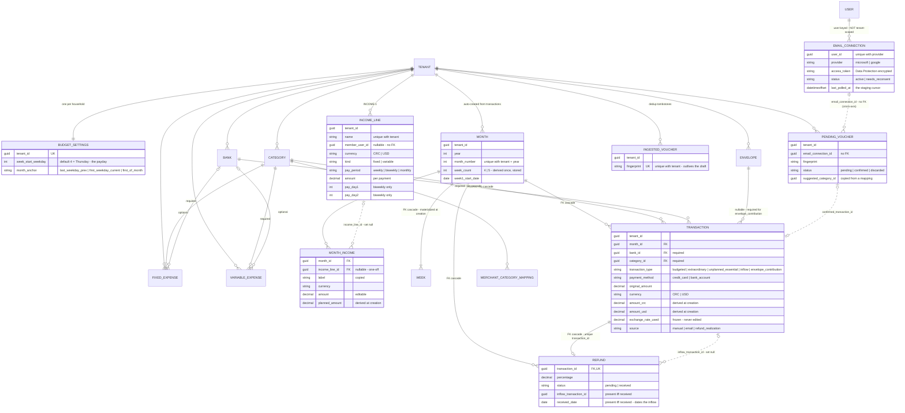

### ER diagram — identity & auth foundation

Drawn from the code (entities in `src/Core/Entities/`, constraints in
`src/Infrastructure/Persistence/Configurations/`). **Solid lines are real FK constraints (there
are only four in the whole model, all cascade); dotted lines are logical, application-enforced
Guid references with no DB constraint.** Invariants are annotated on the columns they protect.
Decision context: [ADR-002](DECISIONS.md) (custom JWT auth), [ADR-003](DECISIONS.md)
(membership-based tenancy), [ADR-012](DECISIONS.md) (MFA), [ADR-013](DECISIONS.md) (notifications).

```mermaid
erDiagram
    TENANT ||--o{ TENANT_MEMBERSHIP : "FK cascade"
    USER ||--o| TENANT_MEMBERSHIP : "FK cascade - unique user_id = one tenant per user"
    TENANT ||--o{ TENANT_INVITATION : "FK cascade"
    USER ||--o{ USER_LOGIN : "FK cascade"
    USER ||..o{ REFRESH_TOKEN : "user_id - no FK"
    USER ||..o| USER_MFA : "user_id unique - no FK"
    USER ||..o{ MFA_RECOVERY_CODE : "user_id - no FK"
    USER ||..o{ NOTIFICATION : "user_id - no FK"
    USER ||..o| NOTIFICATION_PREFERENCE : "user_id unique - no FK"
    USER ||..o{ LOGIN_TOKEN : "by email string only - account resolved at redemption"

    TENANT {
        guid id PK
        string name
    }
    USER {
        guid id PK
        string email UK "unique, normalized lower-case"
        bool email_verified "fail-closed: true only when a provider asserts it"
        string locale "nullable - per-user pref"
        string theme "nullable - stored verbatim (ADR-022)"
    }
    TENANT_MEMBERSHIP {
        guid tenant_id FK
        guid user_id FK,UK "unique - a user is in exactly one tenant"
        string role "owner | admin | member - exactly one owner per tenant"
    }
    TENANT_INVITATION {
        guid tenant_id FK
        string invited_email
        string token_hash UK "SHA-256 - no raw token column"
        string status "pending | accepted | revoked (expired is computed, never written)"
        datetimeoffset expires_at
    }
    USER_LOGIN {
        guid user_id FK
        string provider "unique with provider_user_id"
        string provider_user_id
    }
    REFRESH_TOKEN {
        guid user_id
        string token_hash UK "SHA-256 - DB leak cannot forge sessions"
        bool is_revoked "revoked-but-unexpired rows kept for reuse detection"
        datetimeoffset expires_at
    }
    LOGIN_TOKEN {
        string email "no user FK"
        string code_hash "SHA-256, single-use"
        string purpose "magic-link | otp"
        datetimeoffset consumed_at "nullable - set once, atomically"
        int attempt_count "OTP lockout counter"
    }
    USER_MFA {
        guid user_id UK "one MFA row per user"
        string encrypted_secret "Data Protection - never plaintext"
        bool enabled
        long last_verified_time_step "TOTP anti-replay watermark"
    }
    MFA_RECOVERY_CODE {
        guid user_id
        string code_hash "peppered HMAC - low-entropy secret"
        datetimeoffset used_at "nullable - single-use"
    }
    NOTIFICATION {
        guid user_id "per-user carve-out, NOT tenant-scoped"
        string kind "security.* kinds are non-suppressible"
        datetimeoffset read_at "nullable"
    }
    NOTIFICATION_PREFERENCE {
        guid user_id UK
        bool in_app_enabled "absence of row = both channels on"
        bool email_enabled
    }
```

## Derived rules (computed, never stored)

The budget domain's logic lives in **pure Core services** (no I/O): `WeekBoundaryService`,
`CurrencyMath`, `DashboardSummaryService`, and the voucher parsing library
(`VoucherText`, `SpanishDateParser`, `VoucherFingerprint`, `BankVoucherMap`). Each ships with its
donor test suite (`Core.Tests`).

| Rule | Definition | Where |
|------|------------|-------|
| **Month anchor** | For (year, month, settings): `last_weekday_prev` → last occurrence of the weekday in the previous calendar month; `first_weekday_current` → first occurrence in the month; `first_of_month` → the 1st. | `WeekBoundaryService.GetWeek1StartDate` |
| **Budget month of a date** | The month whose anchor window `[anchor, next anchor)` contains the date — may differ from the calendar month. Always resolve this way, never by calendar month. | `WeekBoundaryService.GetBudgetMonthForDate` |
| **Week count** | Number of whole 7-day weeks that fit before the next anchor: 4 or 5. Stored on `Month` for queries; **weeks are materialized** at creation and never recomputed (a settings change must not re-slice history). | `WeekBoundaryService.GenerateWeeks` |
| **Dual-currency amounts** | `amount_crc` / `amount_usd` = `original_amount` converted by `exchange_rate_used`, rounded to 2 dp with fixed-point arithmetic. Derived **once** at creation with the frozen rate; re-derived on edit only from that same rate. | `CurrencyMath.DeriveAmounts` |
| **Rate resolution** | live quote (cached < 1 h counts as live) → stale cache flagged "as of" → most recent transaction's rate → unavailable. A provider rate ≤ 0 is unavailable. The quote is a buy/sell pair (BCCR compra/venta, ADR-V019); the side used follows the money: spending in USD → sell, in CRC → buy; income in USD → buy, in CRC → sell; budget lines like spending; a single-rate source is both sides equal. `exchange_rate_used` freezes the one side the transaction's currency selects. | `IExchangeRateResolver`, `FxRates` |
| **Month existence** | A month exists ⇔ it has ≥ 1 transaction. Created on the first transaction in its window (income rows snapshotted from the income lines — next row); deleted with its weeks and income rows when the last transaction goes. Refunds never keep a month alive. | `TransactionService` |
| **Month income plan** (INCOME-1) | At month creation, one row per active income line whose member (if any) is still in the household: `planned_amount = amount ×` (weekly → `week_count`; biweekly → the pay days that fall in [first week's start, last week's end], day 31 clamped to the month's last day; monthly → 1), 2 dp. `amount` starts equal and stays editable. | `IncomeSnapshot` |
| **Month income** | Σ each income row converted at the day's rate by the income direction rule (USD at buy, CRC at sell) + Σ inflow transactions' frozen amounts. | `IncomeCalculator` |
| **Income by member** (INCOME-2) | The same pairs cut by `member_user_id`: one slice per current member, one for rows with no member ("household"), one for rows whose member left, one for inflows; empty slices dropped; the slices sum to the month income. Computed per request, never stored. | `IncomeByMember` |
| **Refund** | Exists ⇔ its `unplanned_essential` transaction was flagged with a percentage. `amount_* = percentage × transaction.amount_*` (inherits the frozen rate). Re-derived on transaction edit; removed when the flag or the transaction goes. | `TransactionService.SyncRefundAsync` |
| **Refund realization** | `status = received` ⇔ a linked `inflow` transaction exists (same amounts/rate, the source's bank, `source = refund_realization`). Flipping is a conditional update; the inflow is created/removed symmetrically. | `TransactionService.ApplyRefundStatusAsync` |
| **Envelope contribution** | A transaction of class `envelope_contribution` requires an `envelope_id` and `payment_method = bank_account`. Contributed-this-month = sum of such transactions per envelope; remaining = annual target − contributed. | `TransactionService`, `DashboardSummaryService` |
| **Dashboard summary** | Income (the month's income rows + inflows), expense summary (card/account/total/remainder), budgeted-vs-actual per expense line + "other spending", weekly totals, unplanned subtotal, refunds, envelope reminders (by cadence and week count), bank × payment-method cells, balance figures — every one a CRC/USD pair. Actuals use frozen rates; projections use the resolved live rate. | `DashboardSummaryService.Calculate` |
| **Catalog uniqueness** | Names unique per household, case-insensitively; a clash with an inactive row is a reactivation offer, not an error. `is_active = false` ≠ deleted — inactive names still render on history. | catalog handlers |
| **Voucher completeness** | A parsed voucher is complete ⇔ merchant, amount > 0, currency ∈ {CRC, USD}, date are all present; otherwise `missing_fields` names the blanks and the draft stages incomplete. | `VoucherParser` |
| **Voucher fingerprint** | SHA-256 of `bank + (authorization ?? reference) + amount + date`; when both ids are absent, the provider message id; when that is absent too, no dedup (stage anyway — never silently drop). Dedup is **per household**. | `VoucherFingerprint.Compute` |
| **Merchant suggestion** | Among the household's mappings whose `merchant_pattern` is contained (case-insensitively) in the voucher's merchant, the **longest** pattern wins; its category and class are *copied* onto the draft. Never auto-applied. | `MerchantMappingResolver` |
| **Staging cursor** | Next poll starts at `last_polled_at − 5 min` (overlap; dedup absorbs re-fetches); `import_from` lowers it; `ignore_cursor` bypasses it. Advances only past successfully processed messages. | `VoucherStagingService` |

## Lifecycles — budget domain (planned, from the donor's service code)

### Month — ADR-V005
```mermaid
stateDiagram-v2
    [*] --> Exists : first transaction in the anchor window - weeks materialized, income snapshotted
    Exists --> Exists : transactions added / edited / removed; income edited per month
    Exists --> [*] : last transaction deleted - month + weeks deleted
```

### Refund — ADR-V007
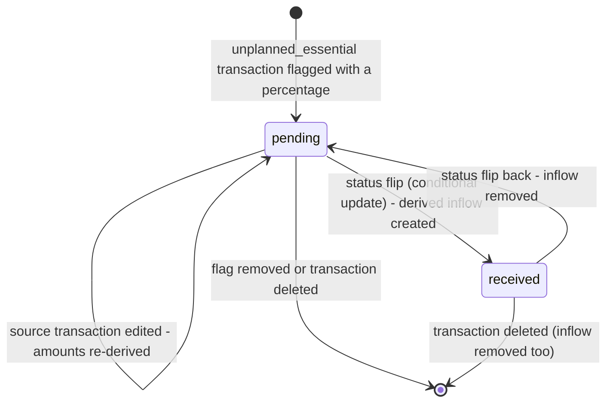

### PendingVoucher — ADR-V010
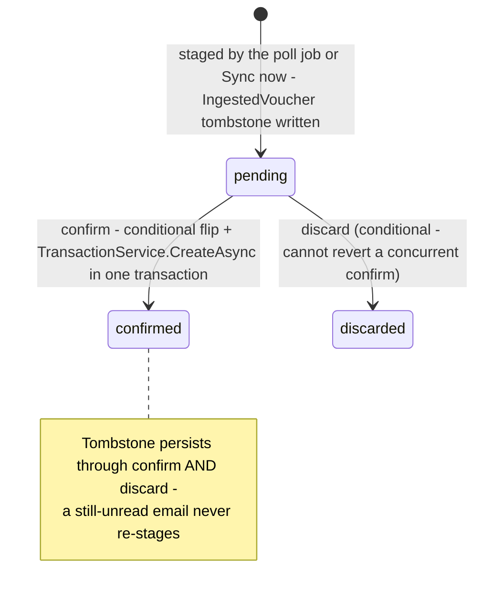

### EmailConnection — ADR-V010
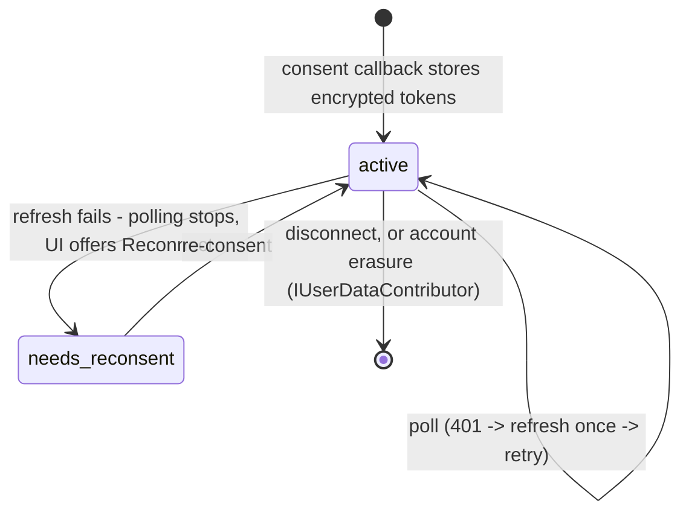

## Platform entities (built — ADRs 006–016)

> These are the tenant-/platform-scoped tables the platform epics added. All have EF Core migrations.
> New app/domain tables you add should implement `ITenantScoped` (so the global tenant filter covers
> them) and register an **`ITenantDataContributor`** (with `ExportKey` + `ExportAsync` **and**
> `HasDataAsync`/`WipeAsync`) so they participate in tenant export + dissolve — there is **no** central
> `HasDataAsync`/`WipeDataAsync` method to edit (adding a feature never means touching central code).

- **`Subscription`** *(ADR-006 / `docs/stories/billing.md`)* — ✅ **BUILT (BILLING-1..7)**:
  `src/Core/Entities/Subscription.cs`, migration `AddSubscription`. `ITenantScoped`, **unique per
  tenant**; `plan_key`, `status`, `stripe_customer_id`/`stripe_subscription_id`, `current_period_end`,
  `lapse_notified_at` (nullable — set by the BILLING-6 lapse sweep so it nudges once per lapse),
  `last_event_at` (nullable — the timestamp of the most recently *applied* webhook event; the handler
  applies an incoming event only if strictly newer, so a redelivered/out-of-order older event can't
  clobber newer state — v2 audit LOGIC-B1). A **projection** of Stripe state (Stripe is the source of
  truth for money); absent ⇒ Free tier (fail-closed), as is any non-active/lapsed status. Plan catalog
  is code (`src/Core/Billing/PlanCatalog.cs`), not a table. Participates in dissolve via
  `BillingDataContributor` (cancels the provider sub + wipes the projection).
- **`UsageCounter`** *(ADR-006 / `docs/stories/billing.md`)* — ✅ **BUILT (BILLING-5)**:
  `src/Core/Entities/UsageCounter.cs`. `ITenantScoped`. A per-tenant, per-period metered-usage counter:
  `key` (the metered action, e.g. "export"), `period` (a calendar month `yyyy-MM`, UTC), `count`,
  `updated_at`. One row per (tenant, key, period) — the month-keyed period makes it **self-resetting
  with no reset job**. `IQuotaService.TryConsumeAsync` increments it and denies once the plan's monthly
  limit is reached.
- **`ApiKey`** *(ADR-015 / `docs/stories/pubapi.md`)* — ✅ **BUILT (PUBAPI-1)**:
  `src/Core/Entities/ApiKey.cs`. `ITenantScoped`. A tenant-scoped API key for programmatic access — only
  the **hash** is stored: `name`, `key_hash` (deterministic hash for O(1) lookup), `prefix` (short
  non-secret display prefix), `scopes` (comma-separated), `created_by_user_id`, `created_at`,
  `last_used_at`, `expires_at` (nullable), `revoked_at` (nullable). The raw key is shown once at
  creation. A presented key authenticates as its tenant (mints a `tenant_id`-claim principal).
- **`WebhookSubscription`** *(ADR-016 / `docs/stories/hooks.md`)* — ✅ **BUILT (HOOKS-1)**:
  `src/Core/Entities/WebhookSubscription.cs`. `ITenantScoped`. A tenant's outbound webhook subscription:
  `url`, `event_types` (comma-separated), `encrypted_secret` (the HMAC signing secret **encrypted** at
  rest via Data Protection — needed in plaintext to sign, so it can't be hashed; revealed once),
  `created_by_user_id`, `created_at`, `disabled_at` (nullable). Delivery goes through the outbox
  (ADR-007), so it's durable + retried.
- **`WebhookDelivery`** *(ADR-016 / `docs/stories/hooks.md`)* — ✅ **BUILT (HOOKS-2)**:
  `src/Core/Entities/WebhookDelivery.cs`. **NOT `ITenantScoped`** — like `OutboxMessage` it's written
  from the tenant-less outbox dispatcher, so `tenant_id` is a **plain filter column** the read side
  filters on, not a global-filter scoping key. A per-attempt delivery record (retries add rows):
  `subscription_id`, `event_type`, `event_id`, `body` (the exact JSON sent — retained so a delivery can
  be **replayed**), `success`, `status_code` (nullable), `error` (nullable), `created_at`. Success rows
  commit atomically with the outbox `sent` flip; **failure rows are written through a fresh out-of-band
  context** so they survive the processor's rollback (2026-08-24 fix — staged failure rows were being
  discarded, leaving the log success-only).
- **`OutboxMessage`**, **`InboxMessage`**, **`AuditEvent`** — see below.

### ER diagram — platform entities (as built)

Drawn from the code. Every dotted line is a **logical** tenant/subscription reference (plain Guid
column, no FK constraint); the platform relies on the global query filter + RLS for isolation, not
on referential integrity to `Tenant`. Decision context: [ADR-006](DECISIONS.md) (billing),
[ADR-007](DECISIONS.md) (outbox/inbox), [ADR-008](DECISIONS.md) (audit),
[ADR-015](DECISIONS.md) (API keys), [ADR-016](DECISIONS.md) (webhooks).

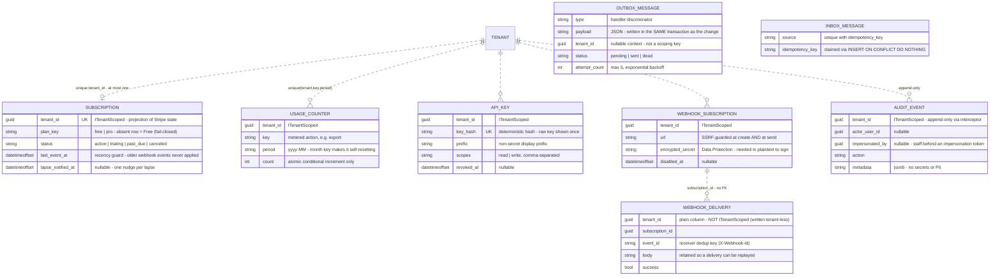

## Platform infra entities (built — not `ITenantScoped`)
- **`OutboxMessage`** *(ADR-007 / `docs/stories/async-jobs.md`)* — ✅ **BUILT (JOBS-1)**:
  `src/Core/Entities/OutboxMessage.cs`, migration `AddOutbox`. **NOT** `ITenantScoped` (platform infra;
  carries an optional `TenantId` for context). `type`, `payload` (text/JSON), `status`,
  `attempt_count`, `next_attempt_at`, `processed_at`, `last_error`. Written in the **same transaction**
  as the business change (atomic effects).
- **`InboxMessage`** *(ADR-007 / `docs/stories/async-jobs.md`)* — ✅ **BUILT (JOBS-2)**:
  `src/Core/Entities/InboxMessage.cs`, migration `AddInbox`. **NOT** `ITenantScoped`. Dedup ledger for
  idempotent inbound (webhook) deliveries: `id`, `source`, `idempotency_key`, `received_at`; **unique on
  `(source, idempotency_key)`**. `IInbox.TryClaimAsync` claims via `INSERT … ON CONFLICT DO NOTHING`
  inside the caller's transaction (claim + work commit together). Built as a separate ledger rather than
  an outbox `direction` column — see the ADR-007 amendment.
- **`AuditEvent`** *(ADR-008 / `docs/stories/observability.md`)* — ✅ **BUILT (OBS-4)**:
  `src/Core/Entities/AuditEvent.cs`, migration `AddAuditEvent`. `ITenantScoped`, **append-only**;
  `actor_user_id`, `action`, `entity_type`, `entity_id`, `metadata` (jsonb), `created_at`. Written via
  explicit `IAuditLog.RecordAsync` (stages on the caller's unit of work); append-only enforced by
  `AuditAppendOnlyInterceptor` (throws on tracked update/delete). `AuditDataContributor` purges on
  dissolve (set-based delete bypasses the guard). No secrets/PII in `metadata`. Dissolve vs retention:
  export-then-wipe if legal-hold is required (GDPR backlog).
## Lifecycles (state diagrams, as built)

Drawn from the service code, not the prose. Each diagram notes where reality diverges from what
the status column suggests.

### TenantInvitation — [ADR-003](DECISIONS.md)

`expired` exists as a constant but **is never written**; expiry is computed against `expires_at`
at accept time. Accept is an atomic conditional update (`TryAcceptAsync` — only one racer wins).

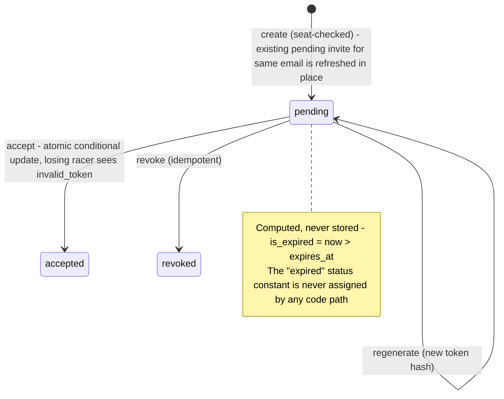

### Subscription — [ADR-006](DECISIONS.md)

The row is a projection; **no row means Free** (fail-closed), and every transition comes from a
signature-verified provider webhook except the staff comp path (ADR-021).

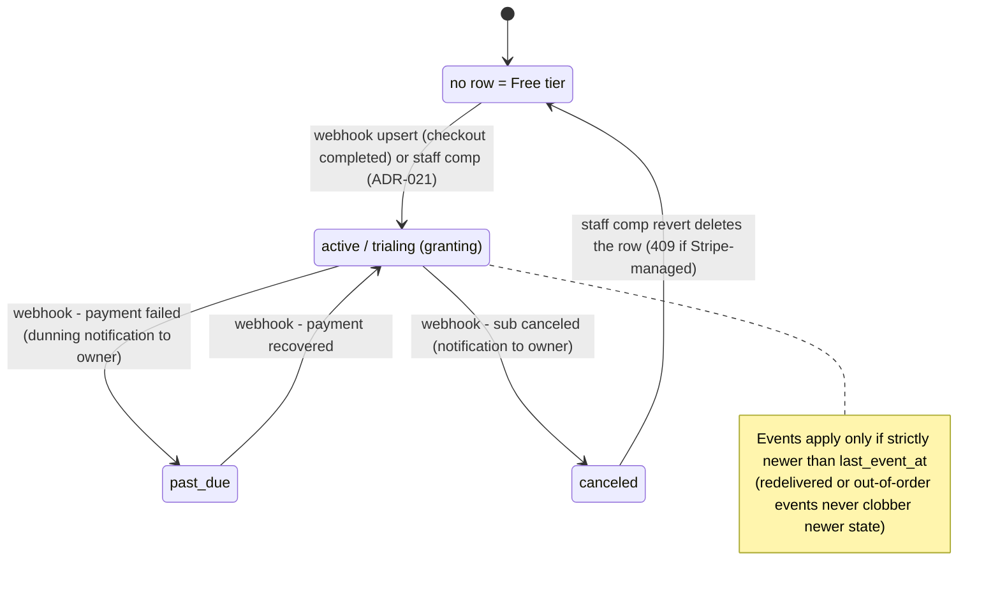

### LoginToken (magic link / OTP) — [ADR-C15](DECISIONS.md)

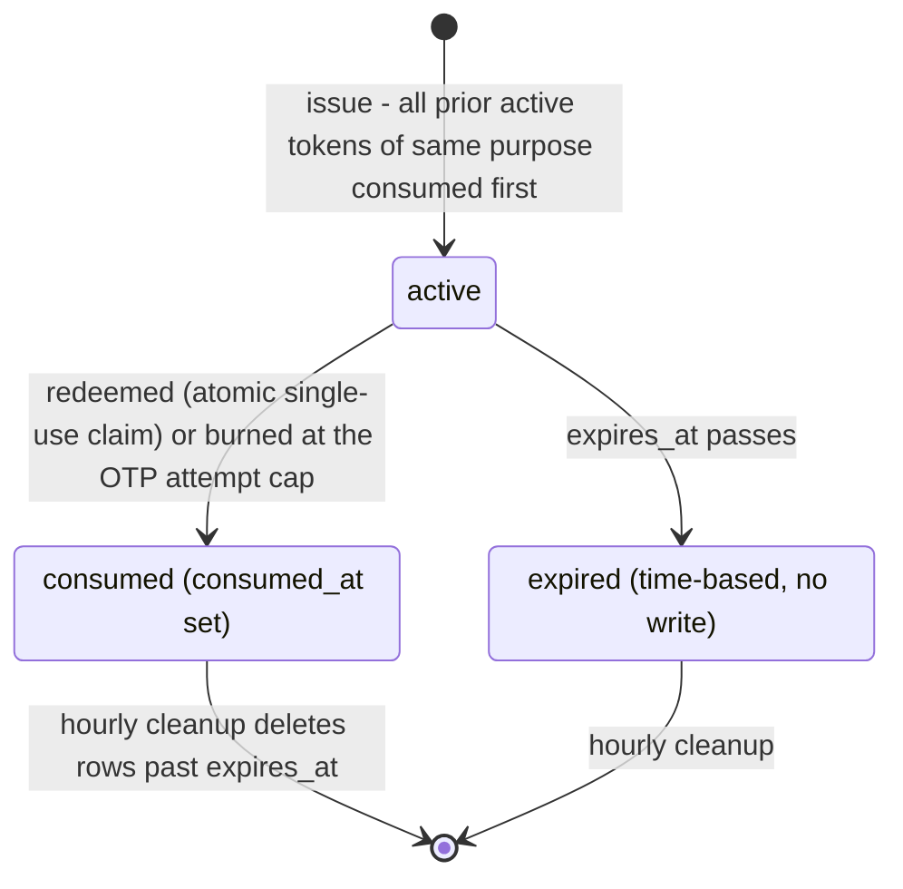

### RefreshToken — [ADR-002](DECISIONS.md)

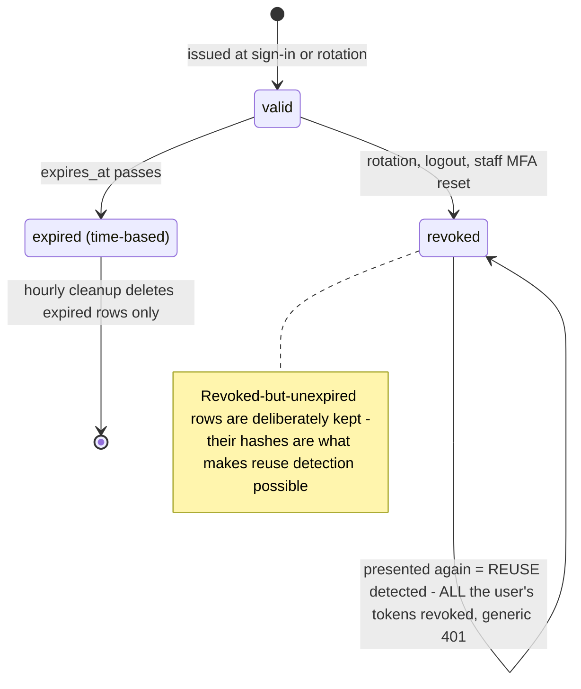

### OutboxMessage — [ADR-007](DECISIONS.md)

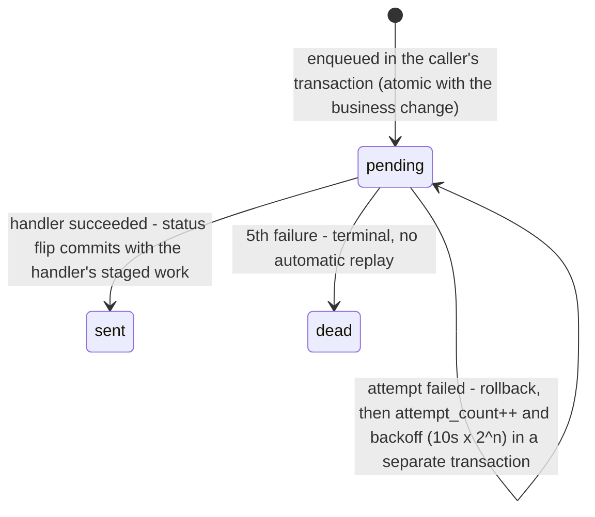

## Pinned model extensions (future, not built)
- SMS/phone field on User — needed when phone-based OTP is implemented.
- New app/domain tables — implement `ITenantScoped` so the global tenant filter covers them, and
  register an `ITenantDataContributor` (`ExportKey` + `ExportAsync` + `HasDataAsync`/`WipeAsync`) so
  they participate in tenant export + dissolve (there is no central wipe method to edit).
- **`BankDefinition`** (+ routing rules) — data-driven voucher extraction, the first post-parity epic.
- **`created_by_user_id`** on transactions — provenance inside a multi-member household; the donor
  deliberately omitted it (ADR-0016 as-built); add additively if attribution is ever needed.
