# Flows — the call stacks that matter, as sequence diagrams

> Companion to [`ARCHITECTURE.md`](ARCHITECTURE.md) (static shape) — this file is the dynamic
> view. Every diagram was traced through the source; file paths are cited under each so you can
> follow along in code. Where a flow diverges from the happy path, the divergence is listed
> beneath the diagram. Flow 3 additionally gets a **line-level walkthrough** (§12) — the bridge
> from design to code.
>
> ER + entity lifecycle diagrams live in [`DATA_MODEL.md`](DATA_MODEL.md); the *why* behind each
> design lives in [`DECISIONS.md`](DECISIONS.md).

## 1. Startup

`src/Api/Program.cs` top to bottom. The two DB steps are fail-closed: migrations can run on a
separate owner connection (ADR-020 two-role topology), and the app refuses to boot if the runtime
DB role could bypass row-level security.

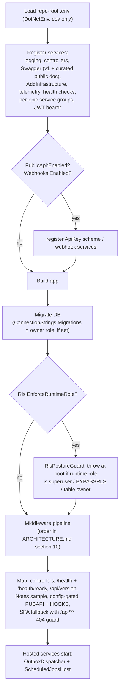

Divergences: no `.env` found → silently skipped (prod uses real env vars). Stripe key present but
wrong mode vs `Billing:Stripe:ExpectLiveKey` → **throws at registration**. No Stripe key outside
Development → **throws** (the fake provider trusts a literal webhook signature and must never boot
in prod).

## 2. Authenticated tenant-scoped request

The tenancy hot path — every `/api/*` request with a JWT. Static picture:
[`ARCHITECTURE.md` §3](ARCHITECTURE.md). Decision: ADR-003 + ADR-020.

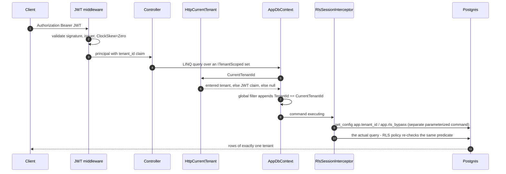

Divergences: no/invalid `tenant_id` claim → `CurrentTenantId = Guid.Empty` → matches no UUIDv7
row (fail closed, empty results rather than an error). A write whose `TenantId` differs from the
current tenant → `TenantStampingInterceptor` **throws**. Cross-tenant reads must use
`QueryAllTenants()` (adds the `rls:cross-tenant` tag the interceptor honors); the tag does not
render into `ExecuteUpdate`, so set-based cross-tenant writes must `EnterTenant` — both rules are
arch-test-enforced.

## 3. Email OTP sign-in

`POST /api/auth/otp/send` → `POST /api/auth/otp/verify`. Line-level walkthrough in §12.
Decisions: ADR-C15, ADR-002, ADR-012.

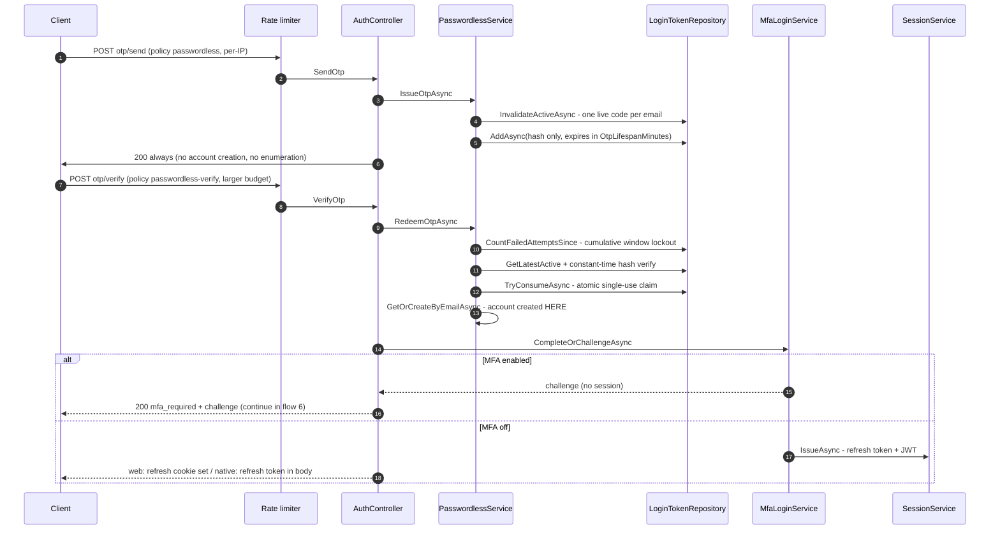

Divergences: wrong code → server-side atomic `AttemptCount+1`, re-check against the **persisted**
window total; at the cap the code is consumed (burned) and `too_many_attempts` returned. `Invalid`
and `Expired` collapse to one client error `invalid_code` (no OTP-existence oracle). Losing an
atomic-consume race → treated as expired. Verify budget = `max(send limit, OtpMaxAttempts + 5)`
so the 401 lockout wins the race against a 429.

## 4. Magic-link sign-in

Same skeleton as flow 3 with three differences: the credential is a 64-byte token in a URL, the
verify endpoint is a **GET that responds with redirects** (never JSON, never a token in a URL),
and the MFA step-up rides `?mfa={challenge}` to the login page.

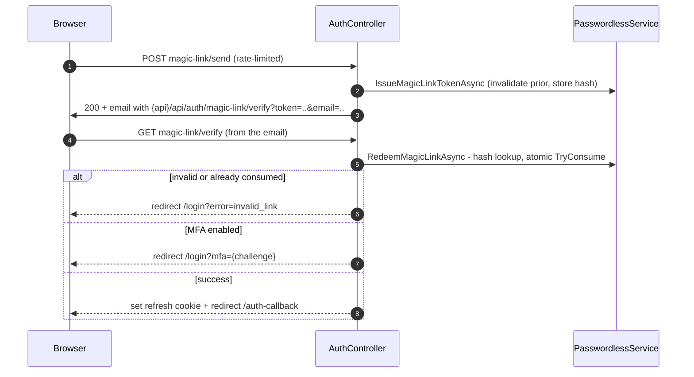

Divergences: email-client prefetch / double-click both reach redemption having seen an unconsumed
row — the atomic claim lets exactly one win. The JWT is never in a URL; the SPA at
`/auth-callback` calls refresh to obtain it. Note: this GET endpoint carries no
`[EnableRateLimiting]` attribute (the token's 64-byte entropy is the defense) — see the
findings list in the repo's task report if that surprises you.

## 5. OAuth (web) sign-in

Google/Microsoft; provider registration is one `.AddXxx()` (ADR-C15). The external principal
rides a dedicated 10-minute `"External"` cookie that exists only for the round trip.

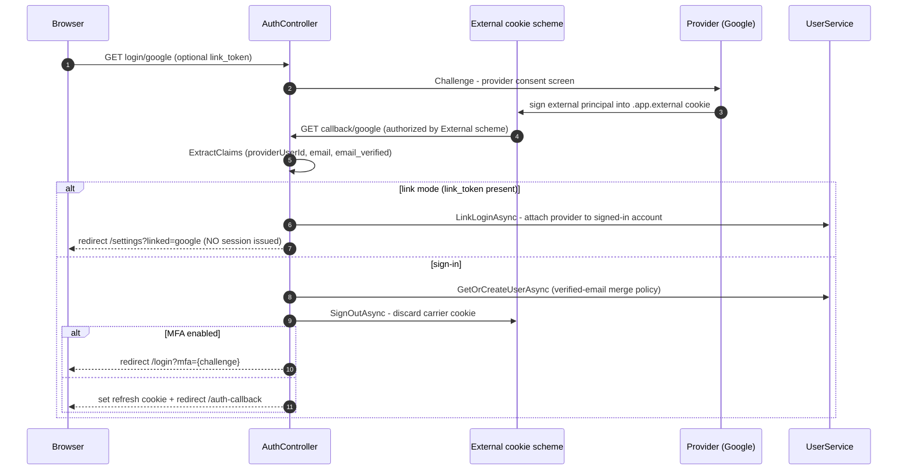

Divergences: unsupported provider / missing claims / any exception → redirect `/auth-error`
(never a 500). Same-email merge is fail-closed: it requires the provider's `email_verified`
claim OR a provider on the `IProviderEmailTrust` allowlist; otherwise
`/login?error=email_unverified`. Native shells use `NativeAuthController` instead: the callback
mints a **single-use code** (tokens never touch the URL), exchanged at `POST native/exchange`
for the session with the refresh token in the body.

## 6. MFA step-up completion

Shared by flows 3–5 and the native path — MFA is enforced on **every** sign-in route (MFA-4).
The ordering is the subtle part: the challenge is claimed **before** the factor check, because
`VerifyAsync` has side effects (burns a recovery code, advances the TOTP anti-replay step).

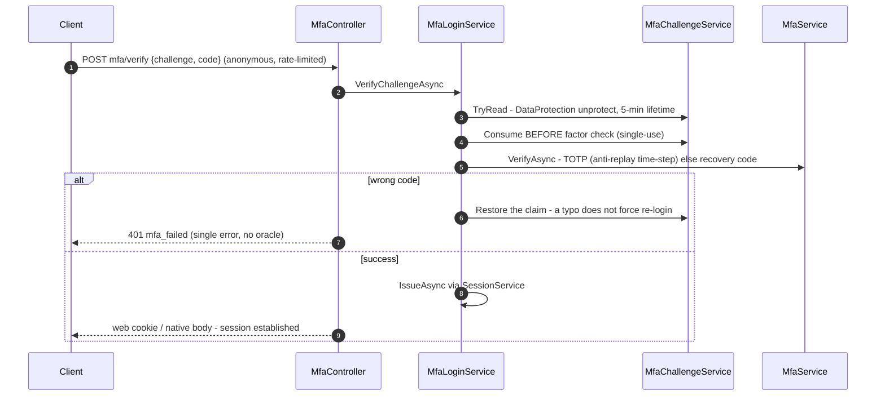

Divergences: tampered/expired challenge or a replayed (already-consumed) challenge → same 401.
A TOTP code at a time-step ≤ the last accepted one is rejected as a replay. Per-user lockout
(`Auth:Mfa:MaxAttempts` in a window) is what caps guessing — a locked account rejects without
consuming an attempt and without leaking that it is locked.

## 7. Refresh-token rotation & reuse detection

`POST /api/auth/refresh` — the web client's session engine (the JWT lives in memory; the HttpOnly
cookie is the durable credential). Decision: ADR-002.

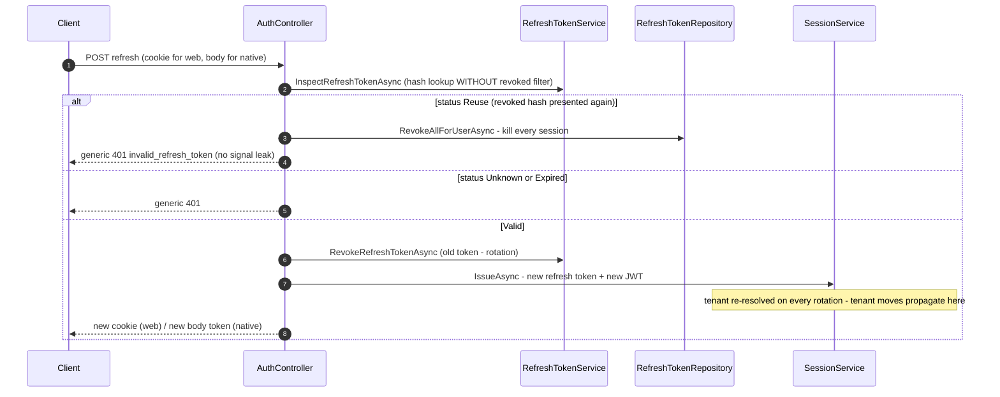

Divergences: revoke uses a tracked load-then-flip (not `ExecuteUpdate`) deliberately, so the
inspection read stays consistent. The hourly cleanup job deletes only **expired** rows —
revoked-but-unexpired hashes are kept because they are what makes reuse detection work.

## 8. Billing webhook (Stripe → subscription projection)

The signature-authenticated system write — the reference for "no JWT, but a trusted tenant id".
Decisions: ADR-006, ADR-007 (inbox).

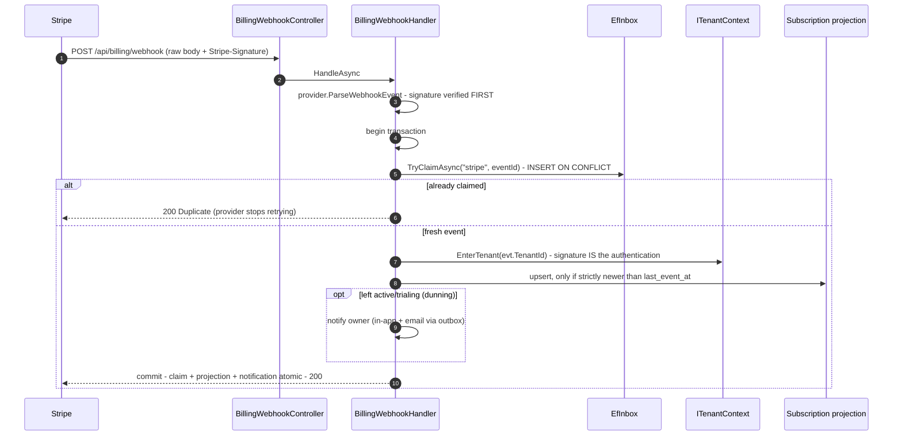

Divergences: bad signature → 400 + warning log with source IP (no payload logged).
Non-subscription events / missing tenant metadata → 200 `Ignored`. Stale/out-of-order event
(older than `last_event_at`, strict `<` — same-second events both apply) → claimed but not
applied, 200. **Any failure inside the transaction rolls back the inbox claim too**, so Stripe's
redelivery reprocesses — exactly-once *effects*, at-least-once delivery.

## 9. Admin announce-all → outbox fan-out (three transactions)

The canonical outbox trace (ADR-007, ADR-013, ADR-021). What makes the fan-out idempotent under
at-least-once retry: **all** the per-user rows and child email messages commit atomically with the
`sent` flip in T2 — a mid-fan-out crash rolls everything back and the retry starts clean.

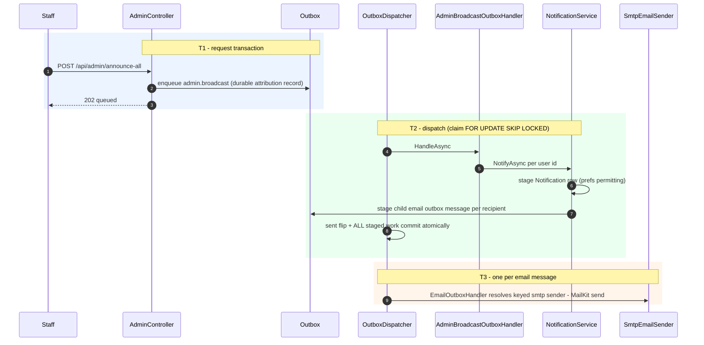

Divergences: any failure in T2 → rollback of every staged row, then attempt bookkeeping in a
separate transaction: `attempt_count++`, backoff `10s × 2^(n−1)`, dead-letter at 5 (terminal — no
automatic replay). SMTP send in T3 is a non-transactional external effect inside a DB
transaction: a crash between send and commit re-sends the email (documented, accepted).
Per-tenant `announce` (not announce-all) fans out synchronously inside one request transaction
instead.

## 10. Outbound webhook delivery (HOOKS)

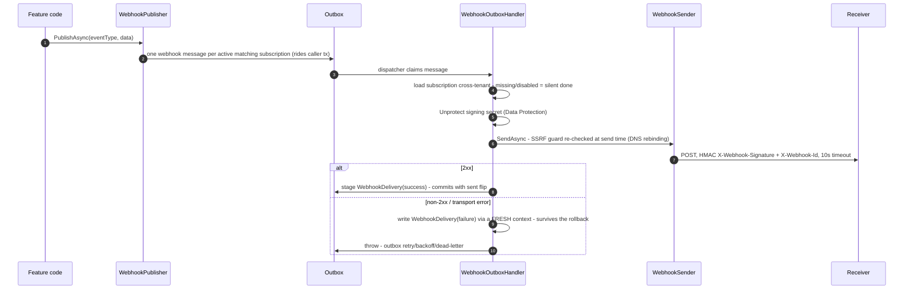

Divergences: the send-test endpoint (`POST /api/webhooks/{id}/test`) bypasses the outbox and
POSTs synchronously. Replay re-enqueues the **same** `EventId` so receivers dedup on
`X-Webhook-Id`. The two recording paths differ deliberately: a success row is staged on the
shared context (commits atomically with the `sent` flip), while a failed attempt is persisted
out-of-band **before** the throw — the processor rolls the ambient transaction back on failure,
which until 2026-08-24 silently discarded staged failure rows and left the delivery log
success-only (fixed; `FailedDelivery_SurvivesTheProcessorRollback_AndRetries` pins it).

## 11. Household dissolve (leave / erasure)

Two entry points share one teardown. The `EnterTenant` inside `TenantDissolutionService` is
load-bearing: contributor wipes are set-based deletes gated by RLS on the *ambient* tenant.
Decisions: ADR-011, ADR-020.

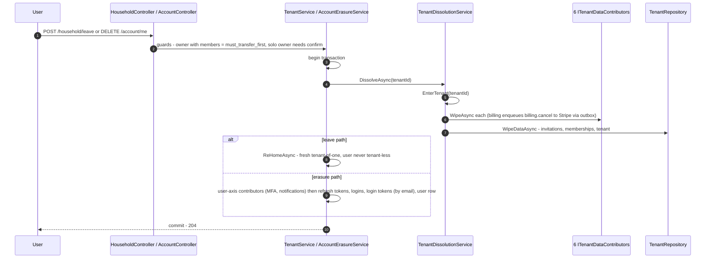

Divergences: leave by a non-owner just removes the membership + re-homes. Erasure of a plain
member records `account.erased` in the surviving tenant and does **not** re-home (the account is
going away). A third dissolve trigger: accepting an invitation as a solo owner dissolves the old
tenant only when every contributor reports it empty (`HasDataAsync` false). The Stripe cancel is
post-commit and idempotent (already-canceled errors swallowed).

## 12. Line-level walkthrough — OTP verify (the sign-in hot path)

Flow 3, step by step through the files. Every line number below was verified by reading the file
at develop `f52be3d`; if the code has moved since, trust the symbol names.

**Entry — `src/Api/Controllers/AuthController.cs`**
- `:305-306` — `[HttpPost("otp/verify")]` under rate-limit policy `passwordless-verify`; the
  policy budget is sized `max(send limit, OtpMaxAttempts + 5)` so the account lockout's 401
  always beats the limiter's 429.
- `:307` — `VerifyOtp(OtpVerifyRequest req, ...)` action entry.
- `:309` — delegates straight to `passwordless.RedeemOtpAsync(req.Email, req.Code, ...)`.

**Credential check — `src/Api/Services/PasswordlessService.cs`**
- `:96-100` — `RedeemOtpAsync` entry; email normalized (`:98` → `:150`, trim + lower); blank code
  short-circuits to `Invalid`.
- `:106-109` — cumulative lockout **pre-check**: sum of `AttemptCount` across *every* code issued
  to this email inside `OtpLockoutWindowMinutes` (`LoginTokenRepository.cs:33-37`, a SQL `SUM`).
  At `OtpMaxAttempts` → `TooManyAttempts`. Resend-proof: a fresh code never grants a fresh budget.
- `:111-113` — newest active code (`LoginTokenRepository.cs:24-31`: unconsumed + unexpired,
  newest first). None → `Expired`.
- `:117` — hash comparison via `TokenHasher.Verify` (`src/Api/Services/TokenHasher.cs:18-29`):
  SHA-256 then `CryptographicOperations.FixedTimeEquals` (`:28`) — constant-time because the OTP
  is low-entropy.
- `:120-121` — the single-use claim: `TryConsumeAsync`
  (`src/Infrastructure/Repositories/LoginTokenRepository.cs:45-53`) is one conditional
  `ExecuteUpdateAsync` with `WHERE ConsumedAt IS NULL` (`:50`), returning `affected == 1`
  (`:52`). Postgres serializes the racing UPDATEs; exactly one caller wins. The loser gets
  `Expired`.
- `:122` — **the account is created here**, at redemption, never at issue
  (`UserService.GetOrCreateByEmailAsync`) — a probed email leaves no row behind.
- `:129-135` — wrong-code path: server-side atomic increment
  (`LoginTokenRepository.cs:55-59`, `SET AttemptCount = AttemptCount + 1` — never
  read-modify-write), re-read the **persisted** window total, and at the cap consume the code to
  lock it (`:133`) → `TooManyAttempts`.

**Back in the controller — `AuthController.cs`**
- `:310-315` — non-success → `OtpErrors.ClientCode` (`PasswordlessService.cs:20-24`) collapses
  `Invalid` and `Expired` into one `invalid_code` 401 (no OTP-existence oracle).
- `:318` — `IsNativeClient` (header `X-Native-Client: true`) picks the refresh-token transport.
- `:319-322` — `MfaLoginService.CompleteOrChallengeAsync`
  (`src/Api/Services/MfaLoginService.cs:30-38`): MFA enabled (`:33`) → mint a 5-minute
  signed single-use challenge (`:34`) and return `200 {mfa_required, challenge}` — **no session
  exists yet**; the client continues at `POST /api/auth/mfa/verify` (flow 6, where the claim at
  `MfaLoginService.cs:50` deliberately precedes the factor check at `:53`).

**Session issuance — `src/Api/Services/SessionService.cs`**
- `:42-48` — `IssueAsync`: refresh token first (`:44`), tenant resolved from the membership
  (`:45` → `:62-68`), then the JWT (`:47-48`).
- Refresh token: `src/Api/Services/RefreshTokenService.cs:60-85` — 64 random bytes (`:67`),
  SHA-256 hash stored (`:68`, never the raw), `ExpiresAt = now + RefreshToken:ExpiryDays`
  (`:77`), IP + provider recorded (`:79-80`).
- JWT: `src/Api/Services/JwtTokenService.cs:38-79` — HMAC-SHA256 (`:45-46`), claims incl.
  `NameIdentifier`, `Email`, `provider`, and — the one everything else hangs off —
  **`tenant_id`** (`:64-65`), which flow 2 turns into the EF filter and RLS GUC. Expiry from
  `Jwt:ExpiryMinutes` on the injected clock (`:71`).
- `SessionService.cs:50-57` — `TokenResponse` assembly; the raw refresh token is put on the body
  **only when native** (`:56`).

**Transport — `AuthController.cs:324-326`**
- Web: `CookieService.SetRefreshTokenCookie` (`src/Api/Services/CookieService.cs:12-40`) —
  HttpOnly, `Secure` iff HTTPS, `SameSite=Lax`, **`Path=/api/auth`** (`:30-39`), expiry matched
  to the server-side token via the same injected clock (`:38`); a legacy `Path=/` orphan cookie
  is expired on every issue (`:23`). Native: the token is already in the body — no cookie.
- `:326` — `200 Ok(session.Response)`; the SPA keeps the JWT in memory and relies on flow 7 to
  stay signed in.
