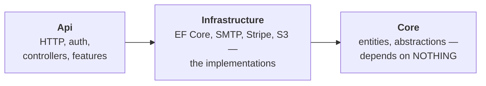

# Lesson 0.1 — The mental model & the decision record

> **Part 0 · Orientation.** No code in this lesson — deliberately. You're about to type
> several hundred files over 50 lessons. The two things that determine whether that makes
> you an architect or a very tired typist are (1) the mental model you hang each file on,
> and (2) the habit of recording *why* before *what*. Both are installed here.

**Goal:** you can draw the system from memory — its layers, its one non-negotiable
invariant, and its unit of work — and you've written your project's first ADR.

**Concepts & principles:** multi-tenancy (tenant ≠ user); clean architecture's dependency
rule; vertical slices vs. horizontal layers; Architecture Decision Records.

**Maps to:** ADR-C1/C2/C3, ADR-004 · `docs/DECISIONS.md`, `docs/WAYS_OF_WORKING.md` in the
reference repo.

---

## 1. What you are going to build

A production-grade, multi-tenant SaaS **platform**: custom JWT auth (passwordless +
OAuth + MFA), tenant isolation enforced by the type system, billing with Stripe, reliable
async via a transactional outbox, RBAC, file storage, GDPR export/erasure, a public API,
outbound webhooks, an admin back-office, observability — deployed to a real host at the
end. Not a to-do app. The kind of chassis a real product bolts features onto.

You will build it **test-first, in vertical slices**, and every architectural rule will be
enforced by a test you wrote — not by a comment hoping to be read.

## 2. The four ideas everything else hangs on

### Idea 1 — Tenant ≠ user

The single most important sentence in this course: **app data belongs to the tenant, not
the user.** A *tenant* is the paying unit — a household, a team, a company. Users are
members of a tenant; they come and go, and the tenant's data stays. Get this backwards
and you'll design tables, queries, and permissions around the wrong axis — and unwinding
that later is a rewrite, not a refactor.

One consequence you'll meet in Lesson 2.6 and never stop meeting: every read and write of
app data must be scoped to the current tenant, and that scoping must be **impossible to
forget**, not merely encouraged.

### Idea 2 — The dependency rule (clean architecture, minus the ceremony)

Three production layers, dependencies pointing strictly inward:



`Core` holds the entities and the *seams* — small interfaces like `IEmailSender`,
`IFileStorage`, `IBillingProvider`. `Infrastructure` implements them with real technology
(MailKit, S3, Stripe). `Api` orchestrates. The payoff is swappability where it matters
(Mailpit in dev, Brevo in prod — same seam) and testability everywhere. The UI (Blazor
WebAssembly) is *just another API client* — it never touches the database.

### Idea 3 — Clean platform + vertical slices (the hybrid)

Pure layered architecture scatters one feature across four folders. Pure
feature-folders duplicate the platform in every slice. This codebase does both,
deliberately, and the split is the point:

- The **platform** — auth, tenancy, billing, email, persistence — is the durable chassis,
  organized in clean layers. Built once, reused by everything.
- Each **app feature** lives in ONE folder (`src/Api/Features/<Feature>/`) containing its
  endpoints, handler, DTOs, and data contributor. Features *reuse* the platform; they
  never reach into each other.

When you wonder "where does this file go?", the question to ask is: *chassis or feature?*

### Idea 4 — Vertical slices as the unit of work

Every increment of work cuts through all layers — DB to UI — and leaves the app working.
You'll never build "all the tables" then "all the endpoints." Each lesson in this course
is itself a slice: it ends with a green build, passing tests, and a tagged checkpoint.

## 3. The decision record — the habit that makes it stick

Here's what separates a codebase you can *maintain* from one you can only *fear*: six
months from now, the question is never "what does this code do?" (you can read it), it's
**"why is it like this — and is it safe to change?"**

An **Architecture Decision Record** answers that in ~10 lines, written at the moment of
decision:

```markdown
## ADR-002 — Custom JWT + rotating refresh tokens (not ASP.NET Core Identity)

**Date:** 2026-06-XX  ·  **Status:** Accepted

**Context:** We need auth for web + native clients with passwordless and OAuth.
Identity brings cookie-centric defaults, schema we don't control, and hides the
token lifecycle we need to reason about (MFA step-up, rotation, native flows).

**Decision:** Issue our own short-lived JWT access tokens + rotating refresh
tokens; store only token hashes.

**Consequences:** We own token security (rotation, reuse detection — must test
it ourselves). In exchange: full control of claims (tenant_id drives data
isolation), one auth model across web/native, no framework fight when MFA lands.
```

Note what an ADR is *not*: not documentation of how the code works (the code shows that),
and never deleted when wrong — a reversed decision gets a **new dated ADR** superseding
the old one. The history of your reasoning is itself an asset.

The reference repo runs on this: 23 app ADRs + amendments in `docs/DECISIONS.md`. Every
lesson ahead ends with an **Architecture Decision box** — the fork faced, the option
chosen, the roads not taken. By Part 4 you should be predicting them before reading them;
that reflex *is* the architectural skill this course exists to build.

## 4. Exercise — write your ADR-000 and ADR-001

Create your project directory (empty — the solution comes in Lesson 1.1) and start the
decision log:

```sh
mkdir my-saas && cd my-saas && git init
mkdir docs && $EDITOR docs/DECISIONS.md
```

Write two ADRs yourself — don't copy:

1. **ADR-000 — Why I'm building this.** Context (what you want to learn), decision (build
   the platform from scratch, test-first), consequences (weeks of effort; deep ownership
   of every line).
2. **ADR-001 — Local secrets live in `.env`, never in the repo.** You haven't built the
   loading mechanism yet (that's 0.2 and 1.4) — which is exactly the point: **the decision
   precedes the code.** Context: secrets in committed files leak (git history is forever).
   Decision: a gitignored `.env` is the single local source of truth; a committed
   `.env.example` documents every key; production uses real environment variables.
   Consequences: one more setup step per machine; zero secrets in history — enforced by a
   scanner you'll add in the next lesson.

`DECISIONS.md` is the first of the planning documents this practice grows into —
`PROJECT_BRIEF.md`, `FEATURES.md`, and `DATA_MODEL.md` follow the same rule of writing
the *why* and the *shape* before the code. You'll rehearse the data-model one hands-on in
the Part 3 capstone (3.7), where the schema entry is written before the entity that
implements it.

## 5. Checkpoint

```sh
git add docs/DECISIONS.md && git commit -m "docs: ADR-000 and ADR-001 — the decision log starts before the code"
git tag lesson-0.1
```

You should now be able to: state the tenant≠user invariant and its consequence for every
future query; draw the three layers and their dependency direction; say which of the two
organizational modes (chassis vs. feature folder) a given file belongs to; and write an
ADR that captures context → decision → consequences in under a page.

**Next:** *Lesson 0.2 — A reproducible machine*, where your ADR-001 gets its mechanical
teeth: `.env.example`, docker-compose, and a secret scanner.
