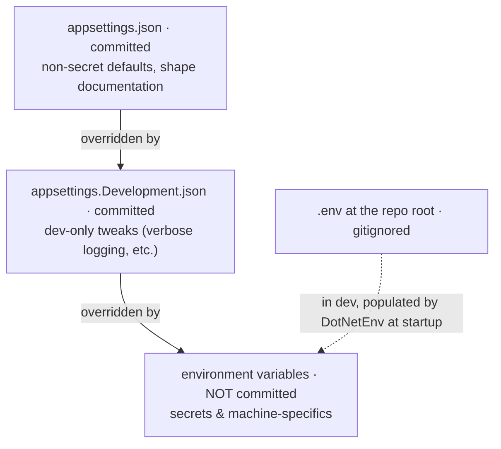

# Lesson 1.4 — Configuration & the options pattern

> **Part 1 · The walking skeleton.** The app can answer HTTP and talk to Postgres; now
> it learns to be *configured* — and, more to the point, to refuse to start when it
> isn't. Configuration is where "works on my machine" goes to hide: a missing key that
> defaults to something plausible, a secret pasted into a JSON file, a setting the code
> reads that nobody documented. This lesson closes all three holes, and closes them with
> machinery, not vigilance.

**Goal:** the API loads `.env` in dev, exposes typed, validated settings objects, fails
at *startup* (not first-use) on missing/invalid config, and a test fails the build when
code reads a config key that isn't documented.

**Concepts & principles:** the config hierarchy; secrets never in the repo (ADR-001
mechanized); typed settings with construction-time validation; fail-fast startup; the
doc-sync gate.

**Maps to:** ADR-001 · R20–R22 · repo: `src/Api/Configuration/SettingsProvider.cs`,
`SettingsRegistration.cs`, `src/Api/Program.cs` (the DotNetEnv line),
`tests/Api.Tests/DocAndConfigSyncTests.cs`, `.env.example`, `appsettings.json`.

**Prerequisites:** 1.3; the `.env` contract from 0.2.

---

## 1. Motivate — the 3 a.m. config bug

Picture the failure mode we're designing against. A service reads
`config["Jwt:Secret"]` deep inside a request handler. On the machine where it's missing,
nothing happens at startup — the app boots, health checks pass, the deploy is declared
good. Hours later the first user tries to sign in and gets a 500, and the stack trace
points at token-signing code, three layers away from the actual problem: a key nobody
set. Now multiply by every config value in the system.

The root defect isn't the missing key — machines will always occasionally be
misconfigured. The defect is **when** and **how** the system tells you. Config errors
should surface at *boot*, in a message that names the key and says where to set it. That
transformation — from runtime mystery to startup message — is what this lesson builds.

And beneath it, a second rule from Lesson 0.1's ADR-001: secrets never live in committed
files. Which raises the practical question: where *does* the app get them, and how do
committed files and secret files cooperate?

## 2. The config hierarchy — one mental model

ASP.NET Core builds `IConfiguration` from layered sources, later layers overriding
earlier ones. Our arrangement (dev):



The elegant part is the last line. Production sets real environment variables; dev keeps
them in the gitignored `.env` from 0.2, and a single line at the very top of
`Program.cs` — before anything reads config — loads them. From the real file:

```csharp
// Local dev: load secrets/config from the repo-root .env (the single local source of
// truth — see docs/DECISIONS.md). TraversePath walks up to find it regardless of the
// working dir; the try/catch makes it a no-op when there's no .env (e.g. production,
// which uses real environment variables).
try { DotNetEnv.Env.TraversePath().Load(); } catch { /* no .env present */ }

var builder = WebApplication.CreateBuilder(args);
```

One mechanism, two environments: to the app, dev and prod look identical — env vars
either way. Nested keys use the `Section__Sub` double-underscore convention (`Jwt__Secret`
in `.env` becomes `Jwt:Secret` to `IConfiguration`), which is the standard env-var
transport for hierarchical config.

`appsettings.json` keeps the **non-secret** shape: section names, defaults worth
committing, values a reviewer should see. It also serves as *documentation of what
exists* — which the gate in §5 exploits.

## 3. Typed settings — validation at construction

Reading `config["Jwt:Secret"]` at call sites scatters string literals through the code,
defers errors to first use, and re-parses on every read. The platform's pattern: one
small class per config section, reading and validating **in its constructor**, registered
as a singleton. The real `JwtSettings`:

```csharp
// src/Api/Configuration/SettingsProvider.cs
public class JwtSettings : IJwtSettings
{
    public string SecretKey { get; }
    public string Issuer { get; }
    public int ExpiryMinutes { get; }

    public JwtSettings(IConfiguration config)
    {
        SecretKey = config["Jwt:Secret"]
            ?? throw new InvalidOperationException(
                "Jwt:Secret not configured (set Jwt__Secret in .env for dev)");
        Issuer = config["Jwt:Issuer"] ?? "Perezosoft";
        ExpiryMinutes = config.GetValue("Jwt:ExpiryMinutes", 60);

        const int MinSecretKeyLength = 32;
        if (SecretKey.Length < MinSecretKeyLength)
            throw new InvalidOperationException(
                $"Jwt:Secret must be at least {MinSecretKeyLength} characters");
    }
}
```

Read the error messages as UX, because they are: each names the key **and the fix**
("set `Jwt__Secret` in `.env` for dev"). Whoever hits this — possibly you, in six
months, on a new laptop — gets handed the solution, not a scavenger hunt. And notice the
*semantic* validation: not just "present" but "at least 32 characters," because an HMAC
key shorter than that is a security bug that would otherwise hide until token validation
mysteriously failed.

Registration happens once, in one place, and the singletons are constructed **eagerly**
so a bad value kills the boot:

```csharp
// src/Api/Configuration/SettingsRegistration.cs (abridged — real file)
public static IJwtSettings AddAppSettings(this IServiceCollection services, IConfiguration config)
{
    // Build JwtSettings once; the same instance backs both the DI singleton and the
    // JWT-bearer TokenValidationParameters — a single source of truth.
    var jwtSettings = new JwtSettings(config);

    services.AddSingleton<IJwtSettings>(jwtSettings);
    services.AddSingleton<IRefreshTokenSettings>(new RefreshTokenSettings(config));
    services.AddSingleton<IApplicationSettings>(new ApplicationSettings(config));
    // ...
    return jwtSettings;
}
```

Two subtleties worth pausing on. The settings are constructed with `new`, *right here*,
not lazily by the container — so startup **is** the validation pass; a missing key can't
lurk until first resolve. And `JwtSettings` is built into a local and *returned*, because
`Program.cs` needs the same values to configure JWT-bearer validation — one instance, two
consumers, zero chance of drift between "the settings DI hands out" and "the settings
auth actually validates with." (A candid note here: rule R22 as written actually names
the *other* shape — typed options via `.BindConfiguration().ValidateOnStart()` — as the
blessed pattern. When the v2 remediation reached this code (B9-2), the platform recorded
the opposite resolution and kept the `IConfiguration`-constructor style you see above:
eager, throwing, already uniform. The tension stands in the record rather than being
papered over — the *decision* that matters is eager validation and one pattern
everywhere, not which library performs it.)

Consumers then depend on `IJwtSettings` — an interface, so tests hand in a stub without
touching `IConfiguration` at all. Config-reading is quarantined to these constructors the
way MailKit is quarantined to `Infrastructure/Email`: one place, one pattern.

**And your 1.2 test just broke — good.** `WebApplicationFactory` boots the *real*
`Program`, which now demands `Jwt:Secret` at startup; the health test dies with the very
`InvalidOperationException` you wrote. This is fail-fast config working exactly as
designed — the test boots the app, the app validates its config, no exceptions for test
mode. The seam is the one the reference harness documents: `Program` reads config at
`CreateBuilder` time, *before* the factory's config hooks run, so the value must exist
as an **environment variable** that early. A static constructor on the test class is the
cleanest place:

```csharp
public class HealthEndpointTests : IClassFixture<WebApplicationFactory<Program>>
{
    static HealthEndpointTests() =>
        Environment.SetEnvironmentVariable("Jwt__Secret",
            "integration-test-jwt-secret-key-0123456789");   // ≥32 chars; value irrelevant
    // ...
}
```

The dummy only needs to *satisfy the validation* (length), because nothing in this test
signs or verifies a token. When the integration harness grows up in Part 2, this seam
moves into its constructor — same idea, one shared home.

## 4. Defaults are decisions

Look again: `Issuer` defaults to `"Perezosoft"`, `ExpiryMinutes` to `60` — but
`SecretKey` throws. Why the asymmetry? Because **a default is a decision that absence is
safe**. A missing issuer name has a sensible universal answer. A missing *secret* does
not — any default would be catastrophic, so absence must be fatal. When you write a
settings class, sort every value into one of these bins deliberately: safe default,
or refuse to boot. (Part 7 adds a third bin for optional *features*: absent config means
the feature is **off** — R21's config-gated default-off. Same principle: absence maps to
the safe state, never the surprising one.)

## 5. The gate — config that can't go undocumented

Now the structural guarantee. Nothing so far stops a developer from reading
`config["Fancy:NewKnob"]` in code and telling no one — until someone deploys without it.
The reference platform closes this with a test that cross-references **code against
documentation**, from the real `DocAndConfigSyncTests`:

```csharp
[Fact]
public void ConfigKeys_ReadInCode_AreDocumented()
{
    // R20: every Section:Key literal read via IConfiguration is documented — either in
    // an appsettings*.json (as a nested path) or in .env.example (as Section__Key).
    // Catches config drift where code reads a key nobody declared.
    var documented = DocumentedConfigPaths();   // parsed from appsettings*.json + .env.example

    var readKeys = new HashSet<string>(StringComparer.Ordinal);
    var access = new Regex(
        @"(?:GetSection|GetValue<[^>]*>|GetValue|configuration|config|Configuration)\s*[\(\[]\s*""([A-Za-z][A-Za-z0-9]*(?::[A-Za-z0-9]+)+)""");
    foreach (var f in SourceFiles(Path.Combine(RepoRoot(), "src")))
        foreach (Match m in access.Matches(File.ReadAllText(f)))
            readKeys.Add(m.Groups[1].Value);

    var undocumented = readKeys.Where(k => !documented.Any(d =>
            d.Equals(k) || d.StartsWith(k + ":") || k.StartsWith(d + ":")))
        .OrderBy(k => k).ToList();

    Assert.True(undocumented.Count == 0,
        $"Config keys read in code but not in appsettings*.json or .env.example: {string.Join(", ", undocumented)}");
}
```

(The quote is trimmed to the core scan. The shipped test additionally captures keys
hoisted into `const string` declarations, single-segment `GetSection("Admin")` binds, and
raw `Environment.GetEnvironmentVariable` reads — three shapes the original regex was
blind to, closed by the v3 audit's T47.)

It's a source scan — grep with a build verdict. Read a key in code without adding it to
`.env.example` or an `appsettings*.json`, and the suite goes red with the key's name in
the failure message. (One adaptation when you write `RepoRoot()`: anchor the upward
directory walk on a file your repo actually has at its root — `global.json` works
perfectly and 0.2 guaranteed it exists.) The documentation *cannot* drift from the code, because drift fails
CI. This is the third face of one idea you now hold: discovery over registration (1.3),
isolation by base class (1.3), documentation by gate (here). None of them ask a human to
remember anything.

Add the corresponding entries to `.env.example` as you go — from 0.2 it's the contract:
every key, a comment saying what it does, required-or-default status. `Jwt__Secret=`
goes in now (empty value, comment "REQUIRED — ≥32 chars").

## 6. Run it — watch it fail correctly

The best test of fail-fast config is failing it on purpose:

```sh
# comment out Jwt__Secret in your .env, then:
dotnet run --project src/Api
# Unhandled exception: System.InvalidOperationException:
#   Jwt:Secret not configured (set Jwt__Secret in .env for dev)
```

Boot refused, key named, fix stated. Restore the key; boots clean. Then run the suite —
including your new doc-sync test — and prove the gate: read a fake key
(`config["Nope:Missing"]`) anywhere in `src/`, watch the test name it, delete the line.

```sh
dotnet test tests/Api.Tests   # all green, including ConfigKeys_ReadInCode_AreDocumented
```

## 7. Architecture Decision

> **The fork:** how does configuration reach the code? (a) `config["key"]` at call
> sites; (b) .NET's options pattern (`IOptions<T>` + `BindConfiguration` +
> `ValidateOnStart`); (c) hand-rolled typed settings classes validating in their
> constructors, registered eagerly as singletons.
>
> **Chosen:** (c) as this platform's single blessed pattern (R22), with ADR-001's `.env`
> as the dev secret source and a doc-sync test (R20) making documentation mandatory.
> Constructor validation gives fail-at-boot with zero framework ceremony, interfaces
> make consumers trivially testable, and *one pattern everywhere* means a new reader
> learns it once.
>
> **Rejected:** (a) scatters literals, defers failure to first use, and is exactly what
> the R20 gate exists to catch. (b) is genuinely fine — `ValidateOnStart` achieves the
> same fail-fast — but brings `IOptions<T>` indirection at every consumer and *two* ways
> to do one thing once any hand-rolled class exists. Uniformity won. The pattern choice
> matters less than the properties: eager, validated, typed, documented.
>
> **The trade:** hand-rolled means we own the validation code, and each new section is a
> small class rather than one `Bind` call. Accepted for a platform this size; revisit if
> settings classes multiply into the dozens.

## 8. Checkpoint

```sh
git add -A && git commit -m "feat: typed validated config — .env loading, fail-fast settings, doc-sync gate"
git tag lesson-1.4
```

You should now be able to: draw the config layering and say where secrets live in dev vs
prod; explain why validation belongs in the constructor and registration must be eager;
sort a config value into "safe default" vs "refuse to boot" and defend the sort; and
describe how the doc-sync gate turns documentation from a request into an invariant.

**Next:** *Lesson 1.5 — The error envelope* — deciding, once, what every error in the
system looks like from the outside.
